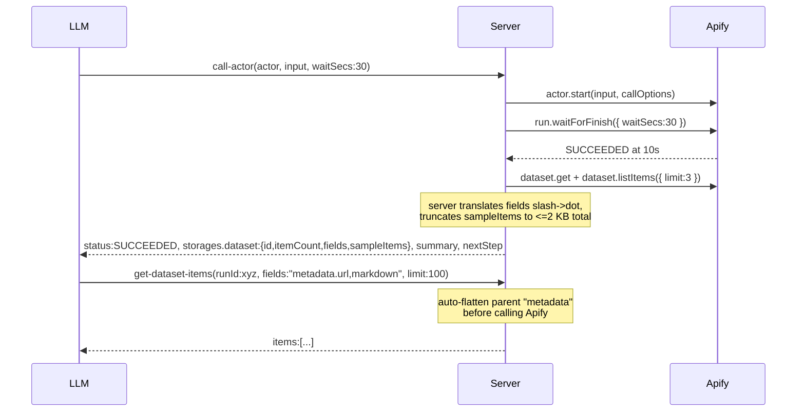
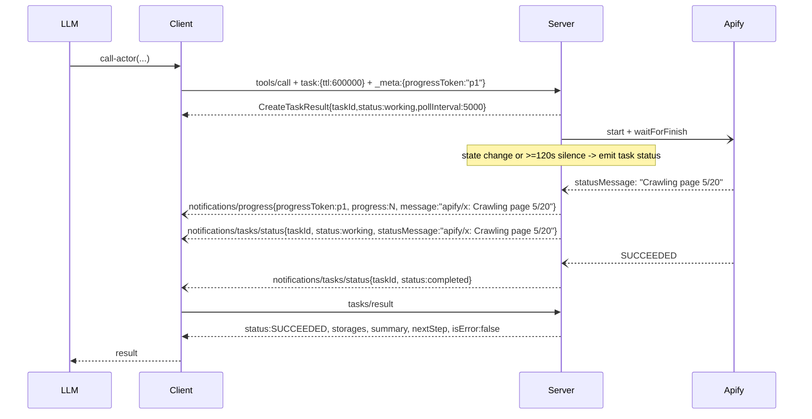

# V3.1 - Final design (delta on v3)

Supersedes v3 after settling open questions and the v3.1 review pass. Read v3 first for the candidate analysis, real I/O baseline, and decision matrix. This file locks the contract for this PR.

This PR deliberately keeps the public tool name `call-actor`. The behavioral contract changes are already large: response shape, output retrieval, task notifications, and dataset field handling. Renaming the tool at the same time would add a second migration axis without fixing the core client problem.

## Locked decisions

| ID | Decision |
|---|---|
| **T1** | `storages` is a subset of the Apify storage API: same field names as `apify-client.Dataset` and `KeyValueStore`, but timestamps are ISO 8601 strings, and fields that are required upstream are optional here when not yet known. We omit security/identity fields (`userId`, `username`, `urlSigningSecretKey`, `generalAccess`, `*PublicUrl`, `actId`, `actRunId`) plus redundant `accessedAt`. We add one field: `sampleItems`. |
| **T2** | `summary` describes the past. `nextStep` prescribes one primary action. Both are camelCase to match the rest of the response. |
| **R1** | Push notifications are required server work. `notifications/progress` is already wired in `src/utils/progress.ts`; `notifications/tasks/status` is missing at the task-store transition points in `src/mcp/server.ts`. Emit `tasks/status` after every task state change and after a heartbeat interval of at least 120 s of silence while a task is still working. |
| **R4** | Keep `call-actor` as the canonical tool name in this PR. Do not add `run-actor`, do not add an alias, and do not change `HelperTools.ACTOR_CALL`. Defer the rename to a separate migration proposal after the new response contract is stable. |
| **Q1** | `sampleItems` carries up to 3 deeply truncated items and never exceeds 2 KB serialized total. |
| **Q2** | `get-actor-run` mirrors `call-actor`'s canonical shape, including `storages.dataset.{fields,sampleItems}` when available. |
| **Q3** | `get-dataset-items` and `abort-actor-run` become available in actor-running workflows through loader auto-injection. Do not add a new globally default category. Keep `get-actor-output` available for one minor cycle, but mark it deprecated and order it after `get-dataset-items`. |
| **Q4** | Slash-to-dot translation is handled by the server for `storages.dataset.fields`. `get-dataset-items` auto-flattens any parent referenced in dot-notation `fields`. The explicit `flatten` arg remains as a diagnostic override. The LLM never sees slashes and never has to compute a flatten set. |
| **Q5** | `isError` is `false` whenever we observe any terminal actor status (`SUCCEEDED`, `FAILED`, `ABORTED`, `TIMED-OUT`). Task mode lands in `status: completed` for observed actor terminal states. Task `status: failed` is reserved for tool-side failures such as auth, validation, network, and server errors. |
| **Q6** | `get-dataset-items` accepts `runId` as an alternative to `datasetId`. |
| **Q7** | `keyValueStore.output` surfaces the conventional `OUTPUT` record inline when present and the dataset has no items. |
| **Q8** | Status enum is the full Apify set: `READY | RUNNING | TIMING-OUT | TIMED-OUT | ABORTING | ABORTED | SUCCEEDED | FAILED`. `ABORTING` and `TIMING-OUT` pass through with their own `summary` and `nextStep` templates. |

Per-change mcpc validation against `dist/stdio.js` is required by `CONTRIBUTING.md`; this plan only spells out the representative cases.

## Why `run-actor` is deferred

The name `run-actor` is clearer, but this PR should not rename the tool.

- The current name is used in the public repo, internal repo tests, internal UI constants, public assets, docs, examples, and MCP Apps widget wiring.
- A hidden alias is not a soft migration. Clients that choose tools from `tools/list` would stop seeing `call-actor`, while hardcoded clients would only work if their arguments and response readers also migrated.
- This PR already changes the output contract. Combining that with a tool identity migration makes regressions harder to isolate.
- The observed client failures are not caused mainly by the word `call`. They are caused by unclear output shape, unclear next action, missing task push updates, and awkward result retrieval.
- A rename can be reconsidered later with a normal deprecation plan: list both tools for one cycle or keep `call-actor` listed with `DEPRECATED:` text, update internal repo first, then remove the old name in a major or explicitly coordinated minor release.

This PR may still use "run" in prose when describing Actor execution. It must not change the MCP tool name.

## Final response shape

Canonical shape shared by `call-actor` and `get-actor-run` after Apify has returned a run. Tool-side failures before a run exists use the existing MCP error response path and do not try to conform to this shape.

`storages.dataset` and `storages.keyValueStore` use Apify-client field names. Timestamps become ISO 8601 strings. `sampleItems` is added.

```ts
{
  responseVersion: "v3.1",
  runId: string,
  actorName: string, // canonical "username/actor-name" when resolvable from the run or actor record
  status: "READY" | "RUNNING" | "TIMING-OUT" | "TIMED-OUT"
        | "ABORTING" | "ABORTED" | "SUCCEEDED" | "FAILED",
  startedAt?: string,
  finishedAt?: string,
  stats?: {
    runTimeSecs?: number,
    computeUnits?: number,
    memMaxBytes?: number,
  },

  storages: {
    dataset: {
      id: string,
      name?: string,
      title?: string,
      createdAt?: string,
      modifiedAt?: string,
      itemCount?: number,
      cleanItemCount?: number,
      fields?: string[], // dot notation, e.g. ["crawl.httpStatusCode", "searchResult.title"]
      stats?: {
        readCount?: number,
        writeCount?: number,
        deleteCount?: number,
        storageBytes?: number,
      },
      sampleItems?: Record<string, unknown>[],
    },
    keyValueStore: {
      id: string,
      name?: string,
      title?: string,
      createdAt?: string,
      modifiedAt?: string,
      stats?: {
        readCount?: number,
        writeCount?: number,
        deleteCount?: number,
        listCount?: number,
        storageBytes?: number,
      },
      output?: {
        contentType?: string,
        value?: unknown,
        sizeBytes?: number,
        truncated: boolean,
      },
    },
  },

  summary: string,
  nextStep: string,
}
```

`_meta` continues to carry usage data via `buildUsageMeta(...)` (`usageTotalUsd`, `usageUsd`). It is not part of the canonical structured shape and is not affected by this redesign.

Notes:

- `itemCount` may briefly lag behind reality. When we observe `itemCount: 0` immediately post-terminal but `dataset.listItems({ limit: 3 })` returns at least one item, re-fetch `dataset.get()` once and use the larger of `dataset.itemCount` or `items.length`.
- `actorName` is taken from the Apify run or actor record, not the tool name. If the canonical name cannot be fetched, use the requested actor name and do not fail the tool because of display-name lookup.
- `fields` is in dot notation. Server reads Apify's slash-form field names and rewrites `/` to `.` before returning them.
- `storages.dataset.id` and `storages.keyValueStore.id` come from the run record (`defaultDatasetId`, `defaultKeyValueStoreId`).

## isError semantics

`isError: false` whenever we observed any terminal actor status: `SUCCEEDED`, `FAILED`, `ABORTED`, or `TIMED-OUT`. The tool succeeded in observing the run; the actor outcome lives in `status` and `summary`.

`isError: true` is reserved for tool-side failures: invalid input, Apify auth failure, network unreachable, server crash, and similar failures before or outside observed actor completion.

In task mode, the task transitions to `status: completed` when we observed the actor finishing, regardless of actor outcome. The task transitions to `status: failed` only for tool-side failures. Because the current MCP task result shape has no dedicated failure reason field, store the failure reason in `task.statusMessage` at the moment the task is marked failed.

An actor `ABORTED` because of `tasks/cancel` maps to task `status: cancelled` through the existing cancel handler. If a result is later fetched, the actor outcome remains `status: ABORTED` inside the response.

## Status template table

Every status returns a concrete `summary` and one primary `nextStep`.

| Status | summary | nextStep |
|---|---|---|
| READY | `"READY. Run ${runId} was created but has not started."` | `"Use get-actor-run with runId=${runId} and waitSecs=10 to wait for progress."` |
| RUNNING | `"RUNNING for ${elapsedSecs}s. ${statusMessage || 'In progress'}."` | `"Use get-actor-run with runId=${runId} and waitSecs=10 to poll for completion."` |
| TIMING-OUT | `"TIMING-OUT after ${elapsedSecs}s. ${statusMessage || 'Run-time limit reached; cleanup in progress'}."` | `"Use get-actor-run with runId=${runId} and waitSecs=10 to observe terminal state."` |
| ABORTING | `"ABORTING after ${elapsedSecs}s. ${statusMessage || 'Cancellation in progress'}."` | `"Use get-actor-run with runId=${runId} and waitSecs=10 to observe terminal state."` |
| SUCCEEDED, dataset has items | `"SUCCEEDED in ${runTimeSecs}s. ${itemCount} items, ${fieldCount} sample fields."` | `"Use get-dataset-items with runId=${runId} and limit=100 to fetch items."` |
| SUCCEEDED, dataset empty + KV OUTPUT present | `"SUCCEEDED in ${runTimeSecs}s. Output was written to key-value store."` | `"Read storages.keyValueStore.output, or use get-key-value-store-record with storeId=${kvId} and recordKey=OUTPUT for the full record."` |
| SUCCEEDED, no dataset items, no OUTPUT | `"SUCCEEDED in ${runTimeSecs}s. No dataset items and no OUTPUT record were found."` | `"Use get-actor-log with runId=${runId} if this was unexpected."` |
| FAILED | `"FAILED after ${runTimeSecs}s${statusMessage ? ': ' + statusMessage : ''}."` | `"Use get-actor-log with runId=${runId} to inspect the failure."` |
| ABORTED | `"ABORTED after ${runTimeSecs}s${statusMessage ? ': ' + statusMessage : ''}."` | `"Use call-actor again if you want to rerun the actor."` |
| TIMED-OUT | `"TIMED-OUT after ${runTimeSecs}s."` | `"Use get-dataset-items with runId=${runId} and limit=100 to fetch any partial output."` |

`elapsedSecs` is `(now - startedAt)` for non-terminal states. `runTimeSecs` comes from `stats.runTimeSecs` for terminal states. `fieldCount` is the count of distinct top-level keys visible in `sampleItems`.

## Text response shape

Most clients consume `structuredContent`; some only see `text`. The text payload is two ordered text blocks:

1. `JSON.stringify(sampleItems)` or `"No sample items available."`.
2. A summary block:
   ```text
   ${summary}
   ${nextStep}

   Run: ${runId} | Status: ${status} | Dataset: ${storages.dataset.id}
   ```

Total text payload is capped at `TOOL_MAX_OUTPUT_CHARS`. If exceeded, truncate or omit the sample block first; preserve the summary block verbatim.

## sampleItems truncation rule

Return up to 3 items. The serialized `sampleItems` payload must be at most 2 KB total.

Per item, walk the JSON tree:

- Strings: first 80 UTF-16 code units plus `[truncated, N chars]` when truncated.
- Arrays: first element plus a sentinel string `[N more]` when more elements exist.
- Objects: recurse into properties in original order.
- Numbers, booleans, and null: preserve as-is.

After per-item truncation, if serialized `sampleItems` still exceeds 2 KB, drop items from the end until either the payload fits or only one item remains. If one item still exceeds 2 KB, run a second pass on that item that replaces deep or long values with short sentinels and drops properties from the end until the payload fits.

Goal: preserve representative field names and enough small values for orientation. Do not promise that every leaf field name is visible.

## callOptions allowlist

`call-actor` validates `callOptions` with a strict Zod object. Allowed keys:

| Key | Type | Why |
|---|---|---|
| `timeout` | number, seconds | Actor run-time cap |
| `memory` | number, MB | Actor memory allocation |
| `build` | string | Specific actor build |
| `maxItems` | number | Charge cap for pay-per-result actors |
| `maxTotalChargeUsd` | number | Charge cap for pay-per-event actors |

Rejected keys:

- `waitForFinish`: use top-level `waitSecs`.
- `webhooks`: redirects run events to caller-controlled URLs.
- `contentType`: this tool sends JSON object input.
- `forcePermissionLevel`: permission escalation should not be exposed here.
- `restartOnError`: can multiply cost without an explicit client workflow.
- `proxy` and any other unknown key.

Current code only documents `memory` and `timeout`; verify current Zod behavior in tests before labeling unknown-key handling as a migration break. The new behavior should be strict rejection, not silent stripping.

## Input compatibility

Canonical input for this PR:

```ts
{
  actor: string,
  input?: unknown,
  waitSecs?: number, // 0-120, default 30 for call-actor
  callOptions?: {
    timeout?: number,
    memory?: number,
    build?: string,
    maxItems?: number,
    maxTotalChargeUsd?: number,
  },
}
```

Deprecated input compatibility for one minor cycle:

- `async: true` maps to `waitSecs: 0`.
- `async: false` maps to the default `waitSecs`.
- If both `async` and `waitSecs` are provided, reject the request as ambiguous.
- `previewOutput` is accepted but ignored. `sampleItems` is always capped to 2 KB, so the old token-risk reason for disabling previews no longer applies.

Do not promote deprecated fields in the tool description. They exist only so old hardcoded callers do not fail immediately.

## call-actor wait behavior

For normal tool calls, `waitSecs` controls how long the server waits for actor completion before returning a non-terminal shape.

- `waitSecs: 0` returns after `actor.start(...)` with `READY` or `RUNNING`.
- `waitSecs` from 1 to 120 starts the actor, then calls `run.waitForFinish({ waitSecs })`.
- Default is 30. Long-running actors return `READY`, `RUNNING`, `TIMING-OUT`, or `ABORTING` with a polling `nextStep`.
- Do not pass `waitForFinish` through `actor.start(...)`; Apify start options cap API-side waiting at 60 s. Use `run.waitForFinish({ waitSecs })` after start.

For task mode, the background task waits until actor terminal state or cancellation. `waitSecs` is ignored in task mode because the client already opted into asynchronous task execution.

## Tool surface

| Tool | Status | Notes |
|---|---|---|
| `call-actor` | Canonical | Keeps existing name. Takes `actor`, `input`, `waitSecs?`, `callOptions?`. `taskSupport: "optional"`. |
| `run-actor` | Deferred | Not implemented in this PR. No alias. |
| `get-actor-run` | Modified | Adds `waitSecs` (0-120, default 0 to preserve current polling behavior). Returns the canonical shape. |
| `get-dataset-items` | Promoted in actor workflows | Accepts `runId` OR `datasetId`. Defaults `limit` to 100 when omitted. Auto-flattens dot-notation `fields`. Explicit `flatten` remains as an override. |
| `abort-actor-run` | Promoted in actor workflows | Auto-injected when actor-running tools are present. |
| `get-actor-output` | Deprecated | Kept for one minor cycle. Still callable. Description starts with `DEPRECATED:` and points to `get-dataset-items`. |

## Loader implementation

Do not change `toolCategoriesEnabledByDefault`. Default categories remain `actors` and `docs`.

Update the auto-inject block in `src/utils/tools_loader.ts`:

- Detect `call-actor`, direct actor tools, and `add-actor` as actor-running workflows.
- Inject `get-actor-run` as today where status polling is needed.
- Inject `get-dataset-items` whenever `call-actor`, direct actor tools, or `add-actor` is present.
- Inject `abort-actor-run` whenever `call-actor`, direct actor tools, or `add-actor` is present.
- Keep `get-actor-output` injected for one minor cycle, but place it after `get-dataset-items` and mark it deprecated in the public description.
- Let the existing de-dup pass handle tools also selected by category.

No `TOOL_NAME_ALIASES` work is needed in this PR because there is no rename.

## get-dataset-items changes

1. Accept `runId` OR `datasetId` with a Zod union/refinement that requires exactly one.
2. When `runId` is provided, resolve `defaultDatasetId` from the run record before calling the dataset API.
3. Default `limit` to 100 when omitted. Keep `offset` default 0.
4. Cap text output with the same `TOOL_MAX_OUTPUT_CHARS` discipline used by actor output tools.
5. Auto-flatten dot-notation `fields`: when any field contains `.`, derive the unique top-level parent before the first dot and pass that as `flatten` to `dataset.listItems`. Add a unit test with a two-level nested field; if Apify flattening is not recursive for that case, derive all needed prefixes instead.
6. If explicit `flatten` is provided, use it and skip auto-derivation.

This removes the main reason `get-actor-output` existed: LLMs can use dot fields without knowing about Apify's `flatten` parameter.

## keyValueStore.output surfacing

When the effective dataset item count is 0 and the run has `defaultKeyValueStoreId`, inspect the `OUTPUT` key.

Implementation order:

1. Call `keyValueStore(kvId).listKeys({ prefix: 'OUTPUT', limit: 1 })`.
2. If `OUTPUT` is absent, omit `storages.keyValueStore.output`.
3. If `OUTPUT` is present and `size > 2048`, do not fetch the body. Return:
   ```ts
   {
     sizeBytes: size,
     value: "[OUTPUT record present, ${size} bytes]",
     truncated: true,
   }
   ```
4. If `size <= 2048`, fetch `getRecord('OUTPUT')`.
5. Inline JSON-compatible values as `value: unknown`.
6. For non-JSON small records, inline text only when safe; otherwise return a descriptor string and `truncated: true`.

Use the effective item count after the post-terminal re-fetch, not only the first `dataset.itemCount` value.

## Push-notification implementation

Current state:

- `src/utils/progress.ts` emits `notifications/progress` when `progressToken` is supplied.
- `src/mcp/server.ts` updates task state but does not emit `notifications/tasks/status`.

Required changes:

1. Add a server-side helper near task handling:
   ```ts
   async function updateTaskAndNotify(taskId, status, statusMessage, mcpSessionId) {
       await this.taskStore.updateTaskStatus(taskId, status, statusMessage, mcpSessionId);
       const task = await this.taskStore.getTask(taskId, mcpSessionId);
       if (task) await extra.sendNotification({ method: 'notifications/tasks/status', params: task });
   }
   ```
   Keep the exact signature idiomatic to the surrounding code.
2. Use that helper for working status updates, cancellation, completed results, payment-required completed results, and failed results. If `storeTaskResult` is the transition point, notify after storing and then fetching the task.
3. `notifications/tasks/status` does not depend on `progressToken`; it depends on task mode and `sendNotification`.
4. Keep `notifications/progress` monotonic. Do not parse percentages from actor `statusMessage`.
5. Heartbeat: while a task is still working and actor status/statusMessage has not changed, emit a `tasks/status` notification no more often than once per 120 s. Use fake timers in unit tests.
6. Store infra failure reasons in `task.statusMessage` before notifying failed status.

## Widget impact

The actor-run widget must support the new shape:

- Read `storages.dataset.id` instead of top-level `datasetId`.
- Read `storages.dataset.sampleItems` instead of `dataset.previewItems`, or fetch `get-dataset-items` with `runId` and `limit` when it needs a larger table.
- Poll `get-actor-run` with `waitSecs: 0` so widget refreshes do not block.
- Accept old shape for one minor cycle only if the widget can do so cheaply. Do not add complex compatibility branches.

## Updated mermaid - Tier A



## Updated mermaid - Tier B task mode



## Migration / breaking changes

| Change | Impact |
|---|---|
| Tool remains `call-actor` | No tool-name migration in this PR. |
| Response: `datasetId` -> `storages.dataset.id` | Hard. Widgets and clients reading top-level `datasetId` must update. |
| Response: `items` removed from `call-actor` / `get-actor-run` | Hard. Replaced by `sampleItems` plus `get-dataset-items`. |
| `previewItems` -> `storages.dataset.sampleItems` | Hard. Different field, smaller capped content. |
| `instructions` -> `summary` + `nextStep` | Hard. Different semantics and names. |
| `schema` field dropped; `fields` returned in dot notation | Hard. JSON Schema generation is removed from this path. |
| `call-actor` default wait changes to 30 s | Hard for long-running actors. They now return a non-terminal status plus `nextStep` instead of blocking indefinitely. |
| `async` parameter deprecated but accepted | Soft. `async: true` maps to `waitSecs: 0`; remove in a later cycle. |
| `previewOutput` deprecated but accepted | Soft. Ignored because `sampleItems` is capped. Remove in a later cycle. |
| `get-actor-output` deprecated | Soft for one cycle. Still callable and still listed when injected or selected, but description points to `get-dataset-items`. |
| `get-dataset-items` auto-flattens dot-notation `fields` | Soft. Explicit `flatten` still works as override. |
| `get-dataset-items` accepts `runId` | Soft. Additive. |
| `abort-actor-run` auto-injected in actor workflows | Soft. Additive. |
| `get-actor-run` adds `waitSecs`, default 0 | Soft. Existing callers keep immediate poll behavior. |
| `isError` unified | Soft for tool-call semantics, but clients using task `failed` to detect actor failure must read inner `status` instead. |
| `keyValueStore.output` surfaced inline when dataset empty | Soft. Additive. |
| `responseVersion: "v3.1"` added | Soft. Additive. |
| `callOptions` strict allowlist | Potentially hard. Verify current unknown-key behavior first; reject unsafe keys explicitly. |
| Status enum widened to all 8 Apify states | Soft. Additive. |

Breaking changes must be coordinated with `apify-mcp-server-internal` before merge.

## Internal repo impact

Verify before merge:

- `call-actor` string references should keep working because the tool is not renamed.
- Response-shape readers must migrate from `datasetId`, `items`, `previewItems`, and `instructions`.
- Tool-list tests must be updated for `get-dataset-items` and `abort-actor-run` injection.
- UI constants and public assets can keep the `call-actor` label in this PR.
- Any internal code assuming `get-actor-output` is the default retrieval tool must move to `get-dataset-items`.

Do not claim the internal repo is automatically compatible. It is only spared the tool-name migration.

## Open follow-ups

- Rename `call-actor` to `run-actor`, if still desired, as a separate migration after v3.1 output shape lands.
- Convert direct actor tools (for example `apify--rag-web-browser`) to the canonical shape. This is important because descriptions currently tell clients to prefer dedicated actor tools. It should be its own PR unless this PR explicitly expands scope.
- Decide when to remove deprecated `async`, `previewOutput`, and `get-actor-output`.
- Consider `taskSupport` on `get-actor-run` after task adoption is measured.
- Tune heartbeat interval after observing real clients.

## Testing checklist

Representative mcpc sequence:

```bash
npm run build
mcpc connect .mcp.json:stdio @stdio
mcpc @stdio restart
mcpc @stdio tools-list
mcpc @stdio tools-call call-actor actor:=apify/rag-web-browser input:='{"query":"mcp","maxResults":1}' waitSecs:=30
mcpc @stdio tools-call call-actor actor:=apify/rag-web-browser input:='{"query":"mcp","maxResults":5}' waitSecs:=0
mcpc @stdio tools-call get-actor-run runId:=<id> waitSecs:=0
mcpc @stdio tools-call get-actor-run runId:=<id> waitSecs:=30
mcpc @stdio tools-call get-dataset-items runId:=<id> limit:=100
mcpc @stdio tools-call get-dataset-items datasetId:=<id> fields:="crawl.httpStatusCode,searchResult.title" limit:=100
mcpc @stdio tools-call abort-actor-run runId:=<running-id>
mcpc @stdio tools-call get-actor-output datasetId:=<id> limit:=100
```

Use a known long-running actor or controlled test actor for the abort case. Do not rely on `waitSecs:=5` to force a running state.

Unit tests:

- `summary` and `nextStep` text for every status row.
- `sampleItems` truncation never exceeds 2 KB and preserves representative fields.
- `call-actor` parser accepts deprecated `async` and `previewOutput` compatibility fields.
- `callOptions` strict allowlist rejects `waitForFinish`, `webhooks`, `contentType`, `forcePermissionLevel`, `restartOnError`, `proxy`, and unknown keys.
- `get-dataset-items` requires exactly one of `runId` or `datasetId`.
- `get-dataset-items` resolves `runId` to `defaultDatasetId`.
- `get-dataset-items` derives auto-flatten parents from dot-notation `fields`.
- `keyValueStore.output` uses key metadata before fetching and does not fetch large records.
- Task status notifications are emitted after working, completed, failed, and cancelled transitions.
- Heartbeat uses fake timers; do not sleep for 120 s in tests.

Integration/manual tests:

- End-to-end `call-actor` against `apify/rag-web-browser`; verify canonical shape.
- `get-actor-run` returns the same canonical shape for the same run.
- `get-dataset-items` with dot-notation `fields` returns nested values without explicit `flatten`.
- KV-only actor inlines `storages.keyValueStore.output`.
- Task mode lands in `completed` for actor `FAILED`.
- Synthetic infra failure lands in task `failed` and populates `task.statusMessage`.
- MCP Apps widget reads the new shape and polls with `waitSecs: 0`.

Agents must not run integration tests; they require `APIFY_TOKEN` and are for humans or CI.
