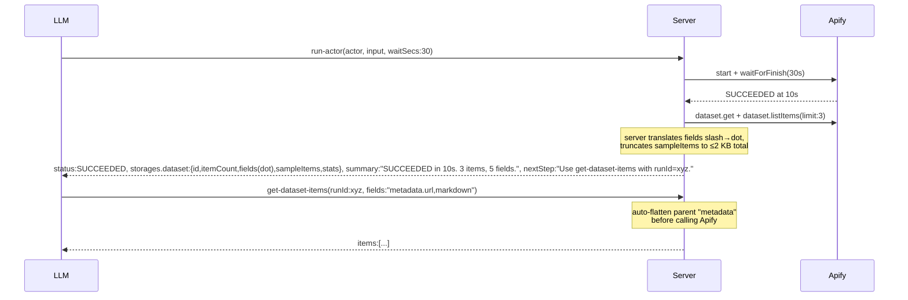
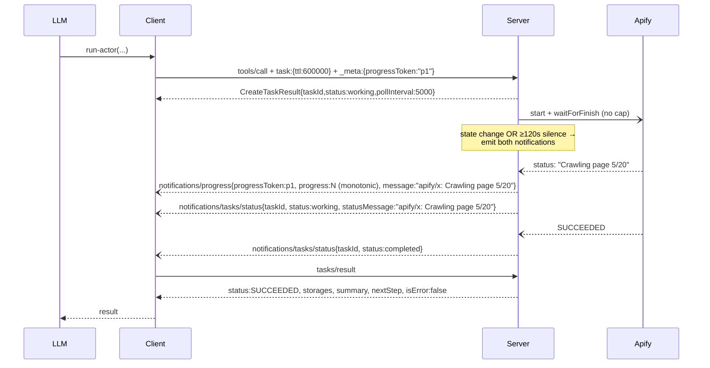

# V3.1 — Final design (delta on v3)

Supersedes v3 after settling open questions and the v3.1 review pass. Read v3 first for the candidate analysis, real I/O baseline, and decision matrix. This file locks the contract.

## Locked decisions

| ID | Decision |
|---|---|
| **T1** | `storages` is a **subset of the Apify storage API** — same field names as `apify-client.Dataset`/`KeyValueStore`, but timestamps are ISO 8601 strings (not `Date`), and fields that are required upstream are optional here when not yet known (e.g. `itemCount` only when terminal). We omit security/identity fields (`userId`, `username`, `urlSigningSecretKey`, `generalAccess`, `*PublicUrl`, `actId`, `actRunId`) plus the redundant `accessedAt`. We add one field: `sampleItems`. |
| **T2** | `summary` describes the past, `nextStep` prescribes one action. **camelCase** to match the rest of the response. |
| **R1** | Push notifications are required server work. `notifications/progress` is already wired (see `src/utils/progress.ts:30-53`); only `notifications/tasks/status` is missing — TODO at `src/mcp/server.ts:1310`. New tracker emits `tasks/status` on every state change AND a heartbeat every ≥120 s of silence. |
| **R4** | Rename `call-actor` → `run-actor`. `call-actor` resolves via a new `TOOL_NAME_ALIASES` map for one minor cycle but is **not** listed in `tools/list`. |
| **Q1** | `sampleItems` carries up to 3 deeply truncated items, ≤2 KB serialized total. |
| **Q2** | `get-actor-run` mirrors `run-actor`'s terminal shape, including `storages.dataset.{fields,sampleItems}`. |
| **Q3** | Promote `abort-actor-run` and `get-dataset-items` into the default toolset; auto-inject of `get-actor-output` next to `call-actor` swaps to `get-dataset-items`. |
| **Q4** | Slash→dot translation handled by the **server** for `storages.dataset.fields`. `get-dataset-items` is changed to **auto-flatten** any parent referenced in dot-notation `fields` — no separate `flatten` parameter required. The `flatten` arg remains as a diagnostic override. LLM never sees slashes; never has to compute a flatten set. |
| **Q5** | `isError` is unified: **always `false`** when we observe any terminal actor status (SUCCEEDED, FAILED, ABORTED, TIMED-OUT). Task mode always lands in `status: completed`; the actor outcome lives in `status`/`summary`. Task `status: failed` is reserved for infrastructure failures (auth, network, server crash). For those, failure reason is stored in `task.statusMessage` to work around the MCP-spec gap on `tasks/result` returning a reason. |
| **Q6** | `get-dataset-items` accepts `runId` as an alternative to `datasetId`. |
| **Q7** | `keyValueStore.output` (the conventional `OUTPUT` record) is surfaced inline when present and dataset is empty. |
| **Q8** | Status enum is the full Apify set: `READY | RUNNING | TIMING-OUT | TIMED-OUT | ABORTING | ABORTED | SUCCEEDED | FAILED`. ABORTING/TIMING-OUT pass through with their own `summary`/`nextStep` templates. |

Per-change mcpc validation against `dist/stdio.js` is required. That requirement lives in `CONTRIBUTING.md`, not as a doc decision.

## Final response shape (canonical, shared by `run-actor` + `get-actor-run`)

`storages.dataset` and `storages.keyValueStore` use Apify-client field names. Timestamps become ISO 8601 strings. `sampleItems` is added.

```ts
{
  responseVersion: "v3.1",                            // bumps on breaking shape changes
  runId?: string,                                     // present once Apify returned a run; absent on pre-start errors
  actorName: string,                                  // canonical "username/actor-name" from the run record
  status: "READY" | "RUNNING" | "TIMING-OUT" | "TIMED-OUT"
        | "ABORTING" | "ABORTED" | "SUCCEEDED" | "FAILED",
  startedAt?: string,                                 // ISO 8601; present once Apify reports a start time
  finishedAt?: string,                                // when terminal
  stats?: {                                           // when terminal — actor run stats, not storage
    runTimeSecs: number,
    computeUnits: number,
    memMaxBytes: number,
  },

  storages: {
    // Subset of apify-client.Dataset:
    dataset: {
      id: string,                                     // always present
      name?: string,
      title?: string,
      createdAt?: string,                             // ISO 8601
      modifiedAt?: string,                            // ISO 8601
      itemCount?: number,                             // present whenever Apify returns it (may be 0; eventual-consistency caveat below)
      cleanItemCount?: number,
      fields?: string[],                              // dot notation, e.g. ["crawl.httpStatusCode", "searchResult.title"]
                                                      // server translates from Apify's slash form
      stats?: {                                       // DatasetStats subset
        readCount?: number,
        writeCount?: number,
        deleteCount?: number,
        storageBytes?: number,
      },
      // Our addition (not in Apify shape):
      sampleItems?: object[],                         // when itemCount > 0 — up to 3 deeply truncated items, ≤2 KB total
    },
    // Subset of apify-client.KeyValueStore:
    keyValueStore: {
      id: string,
      name?: string,
      title?: string,
      createdAt?: string,
      modifiedAt?: string,
      stats?: {                                       // KeyValueStoreStats subset
        readCount?: number,
        writeCount?: number,
        deleteCount?: number,
        listCount?: number,
        storageBytes?: number,
      },
      // Our addition: inline OUTPUT record when present and dataset is empty
      output?: {
        contentType: string,
        value: object | string,                       // for binary content types: descriptor "[binary, N bytes]"
        truncated: boolean,
      },
    },
  },

  summary: string,                                    // see template table
  nextStep: string,                                   // see template table
}
```

`_meta` continues to carry usage data via `buildUsageMeta(...)` (`usageTotalUsd`, `usageUsd`). It is not part of the canonical structured shape and is not affected by this redesign.

**Notes:**

- `itemCount` may briefly lag behind reality. Apify's pagination counter is eventually consistent (up to ~5 s after a run terminates). When we observe `itemCount: 0` immediately post-terminal but `dataset.listItems(limit:3)` returns ≥1 item, we re-fetch `dataset.get()` once and use the larger of `dataset.itemCount` or `items.length`.
- `actorName` is taken from the Apify run record (`actor.username` + `actor.name`), not the tool name.
- `fields` is in dot notation. Server reads Apify's slash-form (`"crawl/httpStatusCode"`) and rewrites to dot (`"crawl.httpStatusCode"`).
- `runId` is optional because pre-start error paths (Zod validation, auth, actor-not-found) return before `actorClient.start()` succeeds.

## isError semantics

`isError: false` whenever we observed any terminal actor status — SUCCEEDED, FAILED, ABORTED, TIMED-OUT. The tool succeeded in observing the run; the LLM reads `status`/`summary` to react. Same rule for sync mode and task mode.

`isError: true` is reserved for tool-side failures: invalid input (Zod), Apify auth failure, network unreachable, server crash. These all return before we have an observed terminal status.

In task mode the task always transitions to `status: completed` when we observed the actor finishing (regardless of outcome). The task transitions to `status: failed` only for the same set of tool-side infrastructure failures. **MCP-spec gap workaround**: the spec doesn't define a dedicated reason field on `tasks/result` when `task.status === 'failed'`. We populate `task.statusMessage` with the failure reason at the moment we set status to `failed`, so clients reading `tasks/get` see it. Track upstream MCP spec for a future dedicated field.

A consequence: an actor `ABORTED` because of `tasks/cancel` no longer maps to `task.failed`. Cancellation already updates the task to `status: cancelled` via the existing `tasks/cancel` handler (`src/mcp/server.ts:729`); the actor outcome flows through as `status: ABORTED` in the response shape if the result is fetched.

## Status template table

Every status returns a concrete `summary` (past) and `nextStep` (one action). Templates use `${...}` placeholders; server fills them in.

| Status | summary | nextStep |
|---|---|---|
| READY | `"READY. Run ${runId} created but has not started."` | `"Use get-actor-run with runId=${runId} and waitSecs to wait for it to start."` |
| RUNNING | `"RUNNING for ${elapsedSecs}s. ${statusMessage \|\| 'in progress'}."` | `"Use get-actor-run with runId=${runId} and waitSecs to poll, or abort-actor-run with runId=${runId} to cancel."` |
| TIMING-OUT | `"TIMING-OUT after ${elapsedSecs}s. ${statusMessage \|\| 'Apify run-time limit reached; cleanup in progress.'}"` | `"Use get-actor-run with runId=${runId} and waitSecs to observe terminal state."` |
| ABORTING | `"ABORTING after ${elapsedSecs}s. ${statusMessage \|\| 'cancellation in progress.'}"` | `"Use get-actor-run with runId=${runId} and waitSecs to observe terminal state."` |
| SUCCEEDED, dataset has items | `"SUCCEEDED in ${runTimeSecs}s. ${itemCount} items, ${fieldCount} fields."` | `"Use get-dataset-items with runId=${runId} (optionally fields=...) to fetch items."` |
| SUCCEEDED, dataset empty + KV OUTPUT present | `"SUCCEEDED in ${runTimeSecs}s. Output written to key-value store."` | `"Output already inlined as storages.keyValueStore.output; for the full record use get-key-value-store-record with storeId=${kvId} key=OUTPUT."` |
| SUCCEEDED, no dataset items, no OUTPUT | `"SUCCEEDED in ${runTimeSecs}s. No items, no OUTPUT record."` | `"Inspect logs via get-actor-run-log with runId=${runId} if this was unexpected."` |
| FAILED | `"FAILED after ${runTimeSecs}s${statusMessage ? ': ' + statusMessage : ''}."` | `"Inspect logs via get-actor-run-log with runId=${runId}. Check input parameters and re-run if the cause is fixable."` |
| ABORTED | `"ABORTED after ${runTimeSecs}s${statusMessage ? ': ' + statusMessage : ''}."` | `"Re-run via run-actor if intended; otherwise no further action."` |
| TIMED-OUT | `"TIMED-OUT after ${runTimeSecs}s."` | `"Increase callOptions.timeout and re-run, or fetch partial output via get-dataset-items with runId=${runId}."` |

`elapsedSecs` is `(now - startedAt)` for non-terminal states. `runTimeSecs` comes from `stats.runTimeSecs` for terminal states. `fieldCount` is the count of distinct top-level keys across `sampleItems` (zero if no items).

## TEXT response shape

Most clients consume `structuredContent`; some only see `text`. The text payload is two ordered text blocks:

1. `JSON.stringify(sampleItems)` (or `"No sample items available."` when absent).
2. A summary block:
   ```
   ${summary}
   ${nextStep}

   Run: ${runId} | Status: ${status} | Dataset: ${storages.dataset.id}
   ```

Total text payload capped at `TOOL_MAX_OUTPUT_CHARS`. If exceeded, `sampleItems` JSON is truncated first; the summary block is always preserved verbatim.

## sampleItems truncation rule

Up to 3 items. Per item, walk the JSON tree:

- Strings → first 80 chars + `[truncated, N chars]` (UTF-16 code units, i.e. JS string length).
- Arrays → first element + `[N more]`.
- Nested objects → recurse with the same rule.

After per-item truncation, if serialized `sampleItems` exceeds 2 KB total, drop items from the end until ≤2 KB. If even one truncated item exceeds 2 KB, ship that single item (we never drop below 1).

Goal: every leaf field name visible to the LLM, no value field carries enough content to be useful as data.

## callOptions allowlist

`run-actor` (and any future tool that accepts `callOptions`) validates the object via Zod. Allowed keys:

| Key | Type | Why |
|---|---|---|
| `timeout` | number (secs) | Run-time cap |
| `memory` | number (MB) | Memory cap |
| `build` | string | Specific actor build |
| `maxItems` | number | Output-item cap |
| `maxTotalChargeUsd` | number | Cost cap |

Rejected (Zod refinement, not silent drop):

- `webhooks` — lets the caller redirect run output to an arbitrary URL; security risk in multi-tenant context.
- `proxy` — use the actor's own input schema instead.
- Any other key.

## Tool surface (final)

| Tool | Status | Notes |
|---|---|---|
| `run-actor` | New name (canonical) | Takes `actor`, `input`, `waitSecs?` (0–120, default 30), `callOptions?`. `taskSupport: "optional"`. |
| `call-actor` | Deprecated alias | Resolves via `TOOL_NAME_ALIASES`; **not** listed in `tools/list`. Removed in v0.11. |
| `get-actor-run` | Modified | Adds `waitSecs` (0–120, default 30). Returns the canonical shape. |
| `get-dataset-items` | **Promoted to default**, behavior change | Accepts `runId` OR `datasetId`. Auto-flattens any parent referenced in dot-notation `fields` (e.g. `fields="crawl.httpStatusCode"` works without explicit `flatten`). The `flatten` param remains as a diagnostic override. Auto-injected next to `run-actor` in place of `get-actor-output`. |
| `abort-actor-run` | **Promoted to default** | No behavior change. |
| `get-actor-output` | Deprecated, retained one minor cycle | Listed in `tools/list` with `DEPRECATED:` prefix. No longer auto-injected next to `run-actor`. Removal in v0.11. |

## Backward-compatibility: alias mechanism

Today's `legacyToolNameToNew(name)` (`src/tools/utils.ts:51-54`) is a function that handles only the `-slash-` → `--` rename — it cannot express arbitrary aliases.

Add a separate `TOOL_NAME_ALIASES` map and a single resolver in `src/tools/utils.ts`:

```ts
export const TOOL_NAME_ALIASES: Record<string, string> = {
    'call-actor': 'run-actor',
};

export function resolveToolName(name: string): string {
    return TOOL_NAME_ALIASES[name] ?? legacyToolNameToNew(name) ?? name;
}
```

Update the single existing caller (`src/mcp/server.ts:819`) to use `resolveToolName(name)`. Do **not** add `call-actor` to `tools/list` — listing two tools with one handler confuses LLMs into picking the deprecated name. Telemetry: log a `tool.deprecated_invoked` event (`{ alias, canonical, mcpSessionId }`) the moment the alias resolves.

`get-actor-output` stays a separately registered tool (not an alias) because its `fields` semantics differ. It emits the same `tool.deprecated_invoked` telemetry on every invocation. Removed in v0.11.

## R1 — push-notification implementation

Today's accurate state, per the code:

- `src/utils/progress.ts:30-53` already emits `notifications/progress` on every state change when `progressToken` is supplied.
- `src/mcp/server.ts:1310` carries the TODO: `notifications/tasks/status` is not emitted.

Required changes:

1. **`src/utils/progress.ts`** — `ProgressTracker.updateProgress(message)`:
   - When `taskId` is set, emit `notifications/tasks/status` with the full Task object (after `taskStore.updateTaskStatus` returns).
   - Throttle: emit on state change (status enum or `statusMessage` text changes), AND emit a heartbeat at most once per ≥120 s of silence so clients can verify liveness for slow runs.

2. **Progress derivation** for `notifications/progress`: monotonic counter (current behavior). We do not parse `statusMessage` for percentages; the message itself tells the LLM what's happening.

3. **Status messages**: `${actorName}: ${statusMessage || status}` (current code already does this).

4. **Failure-reason workaround** for the MCP-spec gap: when `taskStore.updateTaskStatus(taskId, 'failed', reason, ...)` fires (infra failures only), `reason` lands in `task.statusMessage`. Document this in code so the workaround stays visible.

5. **Tests**:
   - Integration test asserts at least one `notifications/tasks/status` arrives between `taskCreated` and `completed`.
   - A long-running test asserts a heartbeat fires after 120+ s of state silence.

## Promoted tools — implementation plan

Locations (correcting the v3 doc): `src/tools/common/abort_actor_run.ts` and `src/tools/common/get_dataset_items.ts`. Both already live in `common/`.

1. Add both to a default-enabled category in `src/tools/categories.ts`. Verify both default mode (`ServerMode.DEFAULT`) and apps mode (`ServerMode.APPS`). Apps mode runs the widget-injection block in `src/utils/tools_loader.ts:276-282`; abort/get-dataset-items don't have widgets, so they appear without one — fine.

2. In `src/utils/tools_loader.ts:249-271`, the auto-inject block currently injects `defaultGetActorRun` and `getActorOutput` next to `call-actor`. **Swap `getActorOutput` for `getDatasetItems`.** `get-actor-output` stays in the default toolset for one minor cycle but is no longer paired with `run-actor` in tool-list ordering — discoverability degrades intentionally because it's deprecated.

## `get-dataset-items` changes

1. Accept `runId` OR `datasetId` (Zod union, exactly one required). When `runId` is provided, server resolves `defaultDatasetId` from the run record before calling Apify dataset API.

2. **Auto-flatten dot-notation fields**: when any entry in `fields` contains a `.`, derive the unique parent set and pass them as `flatten` to Apify's `dataset.listItems({ flatten })` automatically. The explicit `flatten` parameter remains as a diagnostic override and short-circuits the auto-derivation when both are provided.

This is the substantive behavior change of v3.1: it makes `fields` work as the LLM expects without a parallel `flatten` parameter, removing the pitfall that drove the original `get-actor-output` workaround.

## `keyValueStore.output` surfacing

When `dataset.itemCount === 0` and the run has a `defaultKeyValueStoreId`, server attempts:

```ts
const record = await client.keyValueStore(kvId).getRecord('OUTPUT');
```

If present and JSON-typed, inline as:
```ts
storages.keyValueStore.output = { contentType, value, truncated }
```

with the same ≤2 KB truncation rule as `sampleItems`. For non-JSON content types (binary, large text), set `value` to a short descriptor (`"[binary, ${N} bytes]"`) without fetching the body — descriptor size is determined by `HEAD`-style metadata where available, otherwise omit `value`.

## Updated mermaid — Tier A (fast actor)



## Updated mermaid — Tier B (task mode)



## Migration / breaking changes

| Change | Impact |
|---|---|
| `call-actor` → `run-actor` (alias resolves but not listed) | Soft for legacy callers; tools/list shows only `run-actor`. |
| Response: `datasetId` → `storages.dataset.id` | Hard. Widgets and clients reading `structuredContent.datasetId` break. |
| Response: `items` removed | Hard. Replaced by `sampleItems` + `get-dataset-items` call. |
| `previewItems` → `storages.dataset.sampleItems` (≤3 items, truncated, ≤2 KB total) | Hard. Different field, different content. |
| `instructions` → `summary` + `nextStep` (camelCase) | Hard. Different semantics, different names. |
| `schema` field dropped from response; `fields` in dot notation (server translates) | Hard. JSON Schema is gone; field names in dot form. Compute cost reduced (no `generateSchemaFromItems`). |
| `async` parameter removed | Hard. Use `waitSecs: 0`. |
| `previewOutput` parameter removed | Hard. Replaced by always-on `sampleItems`. |
| `get-actor-output` deprecated, no longer auto-injected | Soft for one cycle; reachable via default toolset until v0.11. |
| `get-dataset-items` auto-flattens dot-notation `fields` | Soft. Old explicit `flatten` still works as override. |
| `get-dataset-items` accepts `runId` | Soft. Additive. |
| `abort-actor-run` in default toolset | Soft. Additive. |
| `get-actor-run`: `waitSecs` parameter, mirrored shape | Hard. Existing callers without `waitSecs` now wait up to 30s. Widget passes `waitSecs:0`. |
| `isError` unified (always `false` on observed terminal) | For sync mode: no-op for SUCCEEDED, soft change for FAILED/ABORTED/TIMED-OUT (was already `false` per v3 prose). For task mode: tasks no longer transition to `failed` on actor FAILED — they `complete` with inner status. Clients reading `task.status === 'failed'` to branch break; they should read inner `status`. |
| `keyValueStore.output` surfaced inline when dataset empty | Soft. Additive. |
| `responseVersion: "v3.1"` field added | Soft. Additive. |
| `waitSecs` cap raised 60 → 120 | Soft. Additive. |
| `callOptions` allowlist | Hard for callers passing `webhooks` / `proxy` / unknown keys (formerly silently passed through). |
| Auto-inject swap: `get-actor-output` → `get-dataset-items` next to `run-actor` | Soft. Both remain reachable. |
| Status enum widened to all 8 Apify states | Soft. Additive — new TEMPLATEs for ABORTING/TIMING-OUT. |

Acceptable per `CLAUDE.md` scope discipline: breaking changes are okay when they produce a simpler, clearer implementation.

## Internal repo impact

Verify before merge: search `apify-mcp-server-internal` for imports of changed handlers, response-shape readers (`datasetId`, `items`, `instructions` keys), `call-actor` string references, and any `getActorOutput` injection assumptions. The `TOOL_NAME_ALIASES` mechanism resolves the legacy `call-actor` name, so internal callers continue to function.

## Open follow-ups (out of scope)

- Direct actor tools (e.g. `apify--rag-web-browser`) keep the old shape; convert in a follow-up PR after `run-actor` ships and stabilizes.
- `taskSupport` on `get-actor-run` — deferred until task adoption is measured.
- Heartbeat interval tuning (currently 120 s) after a soak window.
- Future expansion: `keyValueStore.keys?: string[]` if KV store key listing becomes useful.
- `_meta` usage data (`usageTotalUsd`, `usageUsd`) staying in `_meta` rather than canonical structured shape — revisit if widgets want it surfaced.

## Testing checklist

Per-change mcpc validation against `dist/stdio.js` is required and documented in `CONTRIBUTING.md`. Representative command sequence:

```bash
npm run build                                                                                                             # must succeed first
mcpc connect .mcp.json:stdio @stdio                                                                                       # one-time
mcpc @stdio restart                                                                                                       # after each rebuild
mcpc @stdio tools-list                                                                                                    # confirm tool surface; call-actor MUST NOT appear
mcpc @stdio tools-call run-actor actor:=apify/rag-web-browser input:='{"query":"mcp","maxResults":1}' waitSecs:=30
mcpc @stdio tools-call run-actor actor:=apify/rag-web-browser input:='{"query":"mcp","maxResults":5}' waitSecs:=5         # forces RUNNING return
mcpc @stdio tools-call get-actor-run runId:=<id> waitSecs:=30
mcpc @stdio tools-call get-dataset-items runId:=<id>                                                                      # runId path
mcpc @stdio tools-call get-dataset-items datasetId:=<id> fields:="crawl.httpStatusCode,searchResult.title"                # auto-flatten
mcpc @stdio tools-call abort-actor-run runId:=<id>
mcpc @stdio tools-call call-actor actor:=apify/rag-web-browser input:='{"query":"x","maxResults":1}'                      # alias parity (resolved server-side)
mcpc @stdio tools-call get-actor-output datasetId:=<id>                                                                   # deprecated path still works
```

Plus existing test suite:

- **Unit:**
  - `summary` / `nextStep` text per status (every row of the template table).
  - `sampleItems` truncation rule (≤2 KB total, all leaf field names visible, drop-from-end ordering).
  - `TOOL_NAME_ALIASES['call-actor'] === 'run-actor'`; `resolveToolName` precedence (alias > legacy > identity).
  - storages shape conforms to subset of Apify SDK types.
  - `callOptions` allowlist (Zod rejects `webhooks` / `proxy` / unknown).
  - `get-dataset-items` auto-flatten parent derivation from dot-notation `fields`.
  - `keyValueStore.output` surfacing only when dataset empty.
- **Integration:**
  - end-to-end `run-actor` against rag-web-browser; verify shape against `Dataset` / `KeyValueStore` interfaces in apify-client.
  - verify legacy `call-actor` resolves to `run-actor` and produces identical output.
  - verify `notifications/tasks/status` arrives in task mode (extends `scripts/probe-tasks.mjs`).
  - verify heartbeat fires after 120+ s of silence (long-running).
  - verify `get-dataset-items` with dot-notation `fields` returns nested values without explicit `flatten`.
  - verify `keyValueStore.output` inlined for KV-only actor.
  - verify task mode lands in `completed` for actor FAILED; verify `task.statusMessage` populated for synthetic infra failures.
- **Widget:** `actor-run-widget.tsx` reads `storages.dataset.id` instead of `datasetId`; `get-actor-run` polled with `waitSecs: 0`.
- **Manual:** Claude Desktop (stdio), MCPJam, ChatGPT (apps mode).
