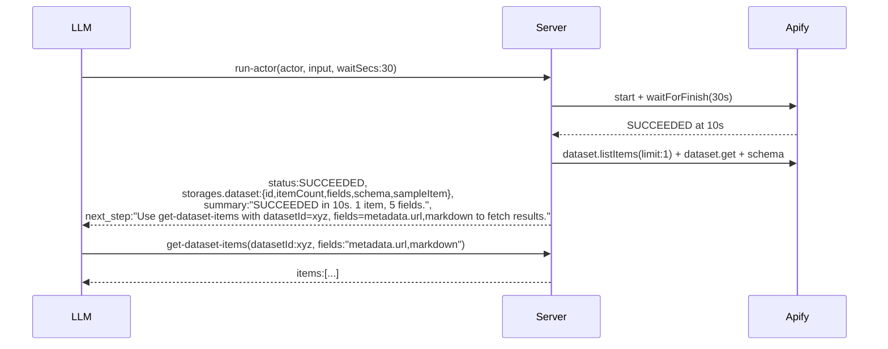
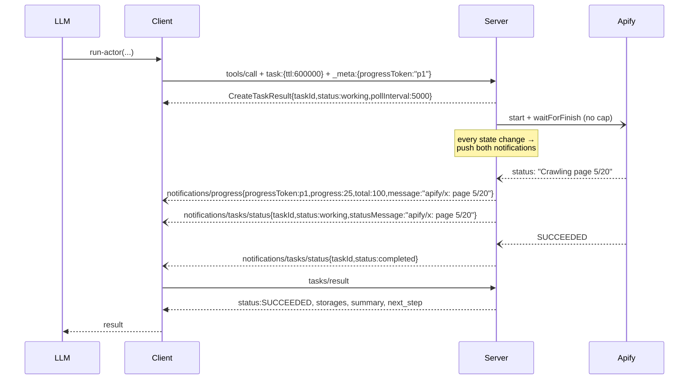

# V3.1 — Final design (delta on v3)

Supersedes v3 after settling open questions. Read v3 first for the candidate analysis, real I/O baseline, and decision matrix. This file locks the contract.

## Locked decisions

| ID | Decision |
|---|---|
| **T1** | Use `storages` object (with `dataset` + `keyValueStore` substructures), not a flat `dataset` field. Future-proof for KV-store keys, request-queue stats, etc. |
| **T2** | Field naming: **`summary`** describes the past, **`next_step`** prescribes one action. No `context`, no `hint`, no `instructions`. |
| **R1** | Push notifications are **required** server work, not optional polish. `notifications/tasks/status` and `notifications/progress` must fire on actor run-status changes. |
| **R4** | Rename `call-actor` → **`run-actor`**. Backward-compatible alias retained for one minor cycle. |
| Q1 | `sampleItem` is the entire data preview — minimal, deeply truncated, one item only. |
| Q2 | `get-actor-run` mirrors `run-actor`'s terminal shape, including `storages.dataset.{schema,fields,sampleItem}`. |
| Q3 | Promote `abort-actor-run` and `get-dataset-items` into the default toolset. |

## Final response shape (canonical, shared by `run-actor` + `get-actor-run`)

```ts
{
  runId: string,
  actorName: string,
  status: "READY" | "RUNNING" | "SUCCEEDED" | "FAILED" | "ABORTED" | "TIMED-OUT",
  startedAt: string,
  finishedAt?: string,                      // when terminal
  stats?: {                                 // when terminal
    runTimeSecs: number,
    computeUnits: number,
    memMaxBytes: number,
  },

  storages: {
    dataset: {
      id: string,                           // always present
      itemCount?: number,                   // when terminal
      fields?: string[],                    // when terminal — flat dot-notation, e.g. ["searchResult.title", "metadata.url"]
      schema?: object,                      // when terminal — JSON Schema inferred from items
      sampleItem?: object,                  // when terminal AND itemCount > 0 — 1 item, deeply truncated
    },
    keyValueStore: {
      id: string,                           // always present
      // future expansion: keys, recordSizes, output — added without breaking shape
    },
  },

  summary: string,                          // "SUCCEEDED in 22s. 47 items, 8 fields."
  next_step: string,                        // "Use get-dataset-items with datasetId=xyz, fields=searchResult.title,metadata.url to fetch results."
}
```

`isError`:
- `false` for any observed terminal status, including FAILED/ABORTED/TIMED-OUT — the tool succeeded in observing the run; LLM reads `status` + `summary` to react.
- Exception: under task mode, when actor terminates non-SUCCEEDED, set `isError: true` so the MCP task transitions to `failed` per spec.

## `sampleItem` truncation rule

Long strings → first ~80 chars + `[truncated, N chars]`.
Arrays → first element + `[N more]`.
Nested objects → recurse with same rule.
Hard cap: serialized `sampleItem` ≤ 2 KB.

Goal: every leaf field name visible to the LLM, no value field carries enough content to be useful as data. The LLM uses it to construct a precise `get-dataset-items` call (which fields to request, what types to expect).

## Tool surface (final)

| Tool | Status | Notes |
|---|---|---|
| `run-actor` | New name (canonical) | Takes `actor`, `input`, `waitSecs?` (0–60, default 30), `callOptions?`. `taskSupport: "optional"`. |
| `call-actor` | Deprecated alias of `run-actor` | One minor cycle; description prefixed with deprecation notice. Identical handler. |
| `get-actor-run` | Modified | Adds `waitSecs` (0–60, default 30). Returns the canonical shape above. |
| `get-dataset-items` | **Promoted to default toolset** | Already exists in storage tool group; move to defaults. |
| `abort-actor-run` | **Promoted to default toolset** | Already exists in runs tool group; move to defaults. |
| `get-actor-output` | Removed | `get-dataset-items` replaces it. Schema-incompatible — no alias. |

## Backward-compatibility plan for `call-actor` → `run-actor`

The codebase already has a legacy-name resolution path (`legacyToolNameToNew` in `src/tools/utils.ts`). Use it.

1. Register the tool under the canonical name `run-actor`. Implementation in `src/tools/default/run_actor.ts` (move from `call_actor.ts`).
2. Add `call-actor` as a **registered alias** in the tool list:
   - Same handler, same Zod schema.
   - Description prefixed: `"DEPRECATED: use run-actor. This name will be removed in v0.11. " + <new description>`.
   - Listed in `tools/list` so older agents discover it.
3. `legacyToolNameToNew["call-actor"] = "run-actor"` so any internal routing uses the canonical handler.
4. Telemetry: when invoked via `call-actor`, log a deprecation event so we can measure adoption before removal.
5. Remove the alias in v0.11 (one minor version after release of v3.1).

Same pattern is NOT applied to `get-actor-output`: its response shape is fundamentally different from `get-dataset-items` (different field names, different pagination semantics), so an alias would silently change behavior. Document the migration in CHANGELOG and tool descriptions instead.

## R1 — push-notification implementation scope

Today's `ProgressTracker` (`src/utils/progress.ts`) calls `taskStore.updateTaskStatus()` on each Apify run-status poll, but no push notification is emitted. Probe confirmed zero `notifications/progress` and zero `notifications/tasks/status` during a 10 s task-mode run.

Required changes:

1. **`src/utils/progress.ts`** — `ProgressTracker.updateProgress(message)`:
   - When the request carries `_meta.progressToken`, send `notifications/progress` with `{ progressToken, progress: <derived %|null>, total: <null|known>, message }`.
   - When the request is task-augmented, also send `notifications/tasks/status` with the full Task object (after `taskStore.updateTaskStatus` returns).
   - Throttle: emit only on state change (status enum or `statusMessage` text changes). Don't fire every 5 s tick if nothing changed.

2. **Server capability declaration** unchanged — `tasks: { list, cancel, requests: { tools: { call } } }` already declared (probe confirmed).

3. **Status messages** — leverage Apify run's `statusMessage` field (already populated by Apify for many actors, e.g. `"Crawled 17/50 pages"`). Pass through verbatim, prefixed with actor name.

4. **Tests**: integration test that asserts at least one `notifications/tasks/status` arrives between `taskCreated` and `completed`.

## Promoted tools — implementation note

In `src/utils/tools_loader.ts`, the default tool set is selected from groups. Move `abort-actor-run` from the `runs` group and `get-dataset-items` from the `storage` group into whatever set is loaded for the default mode. Verify the apps mode tool set independently — it currently excludes some actor-runs tools and may need separate treatment.

## Updated mermaid — canonical fast-actor flow (Tier A)



## Tier B (task mode) with push notifications — final flow



## Migration / breaking changes

| Change | Impact |
|---|---|
| `call-actor` → `run-actor` | Soft: alias preserves Tier-A behavior for one minor cycle. |
| Response shape: `datasetId` → `storages.dataset.id` | Hard. Clients that read `structuredContent.datasetId` break. |
| Response shape: `items` removed (sync mode) | Hard. Clients that read `structuredContent.items` break. They must call `get-dataset-items`. |
| `previewItems` → `storages.dataset.sampleItem` (single, truncated) | Hard. Different field, different content. |
| `instructions` → `summary` + `next_step` | Hard. Different semantics. |
| `async` parameter removed | Hard. Use `waitSecs: 0` instead. |
| `previewOutput` parameter removed | Hard. Replaced by `sampleItem` truncation rule (always present, always tiny). |
| `get-actor-output` removed | Hard. Use `get-dataset-items`. |
| `get-dataset-items` in default toolset | Soft. New tool appears, no removals. |
| `abort-actor-run` in default toolset | Soft. New tool appears. |
| `get-actor-run`: `waitSecs` parameter, mirrored shape | Hard. Existing callers without `waitSecs` now wait up to 30 s. Widget passes `waitSecs: 0`. |

Acceptable per CLAUDE.md scope discipline: breaking changes are okay when they produce a simpler, clearer implementation.

## Internal repo impact

`apify-mcp-server-internal` does not import the changed handlers. Verify integration tests after merge. The `call-actor` alias means existing internal references continue to resolve.

## Open follow-ups (out of scope here)

- Direct actor tools (e.g. `apify--rag-web-browser`) keep the old shape for now. Convert in a follow-up PR after `run-actor` ships and stabilizes.
- `get-dataset-items` accepting `runId` as alternative to `datasetId` — convenience improvement.
- Surface `keyValueStore.output` (the conventional `OUTPUT` record) in `storages.keyValueStore` when present — useful for actors that don't write datasets.
- `taskSupport` on `get-actor-run` — deferred until task adoption is measured.

## Testing checklist

- Unit: `summary` text per status; `next_step` text per status; `sampleItem` truncation rule; `legacyToolNameToNew["call-actor"]`.
- Integration: end-to-end `run-actor` against rag-web-browser; verify shape; verify `call-actor` alias produces identical output; verify push notifications arrive in task mode.
- Widget: `actor-run-widget.tsx` reads `storages.dataset.id` instead of `datasetId`; `get-actor-run` polled with `waitSecs: 0`.
- Manual: Claude Desktop (stdio), MCPJam, ChatGPT (apps mode).
