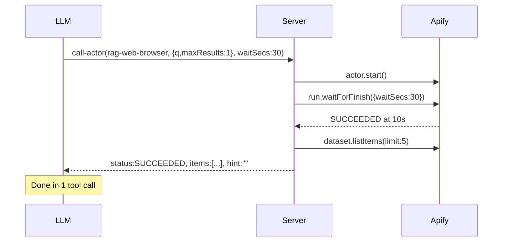
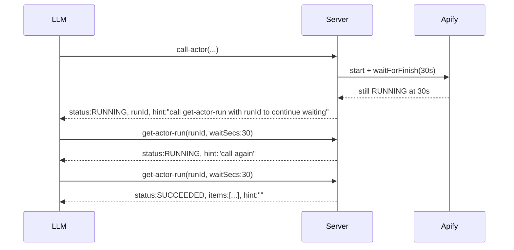
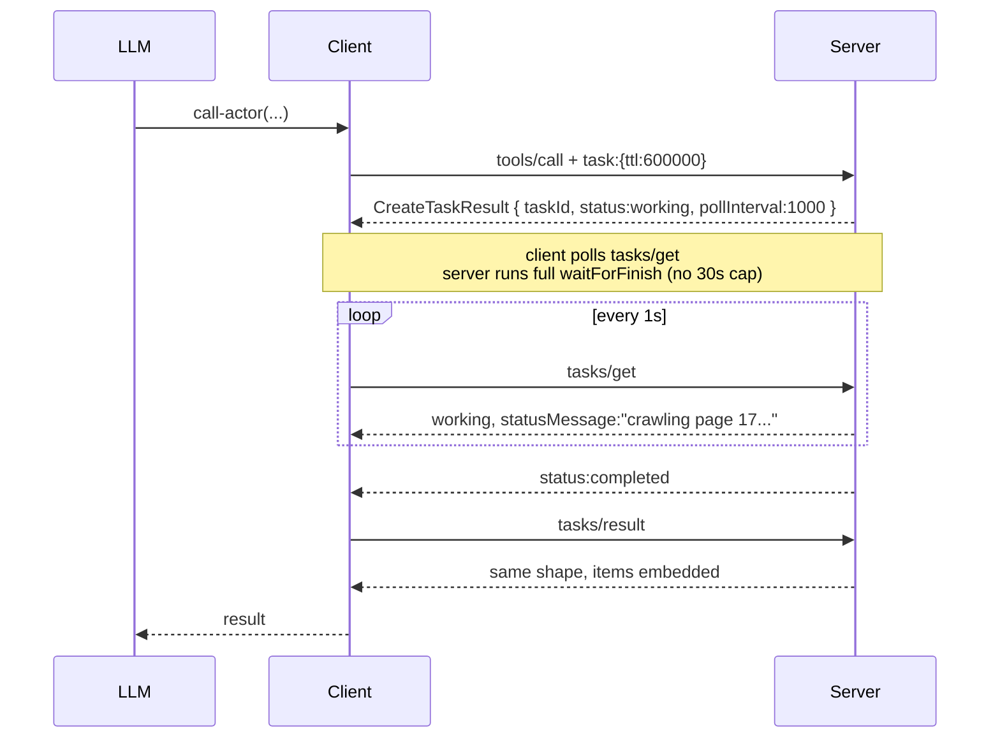
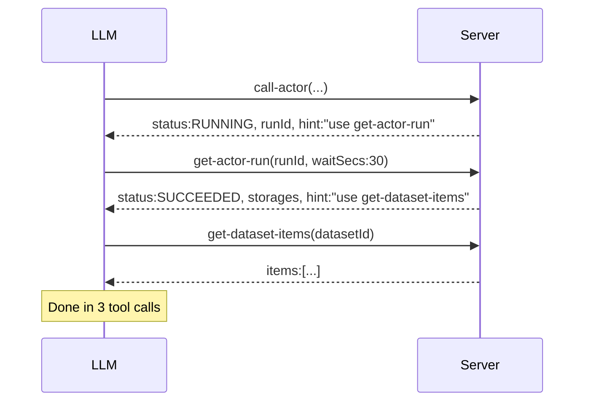
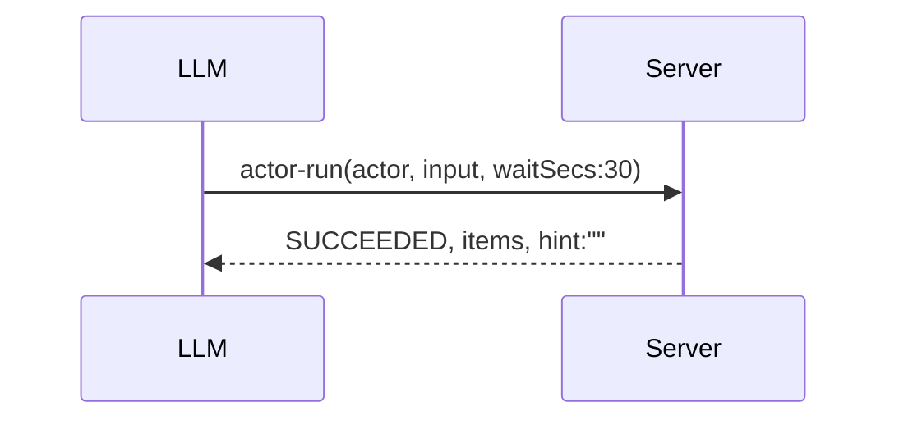
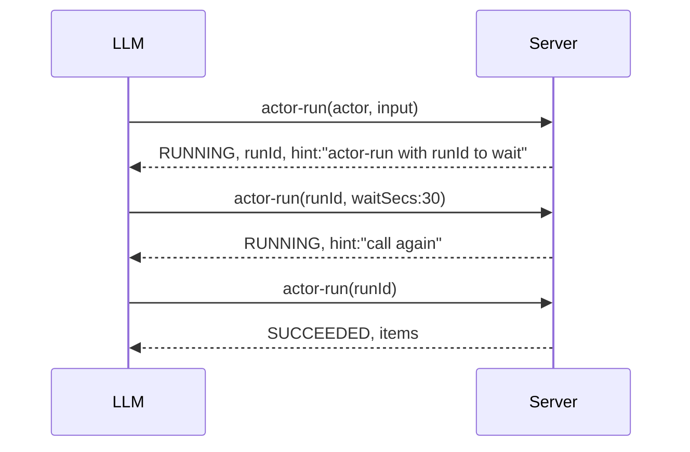
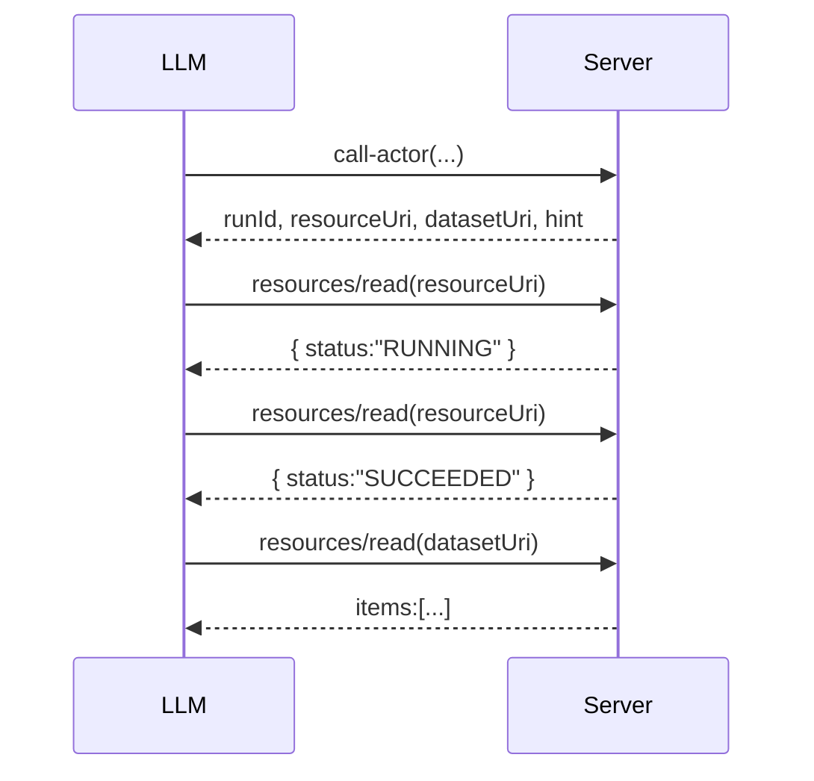
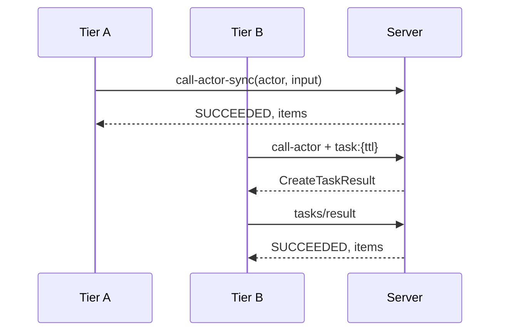

# V3 Design — `call-actor`, `get-actor-run`, dataset tools

Supersedes v2 and #582 after probing the live server. Grounded in real I/O captured against `dist/stdio.js` (see `scripts/probe-design.mjs` and `scripts/probe-tasks.mjs`).

---

## 1. Real I/O baseline (from probes)

### A. Sync `call-actor` today — fast actor, small dataset

`apify/rag-web-browser`, `{ query, maxResults: 1 }` → ~10 s

```json
structuredContent: {
  "runId": "BO89y3hJpKJNdb5su",
  "datasetId": "ETvVAT89129t26Cku",
  "totalItemCount": 1,
  "items": [{ "crawl": {...}, "searchResult": {...}, "markdown": "...6KB..." }],
  "instructions": "If you need to retrieve additional data, use get-actor-output with datasetId..."
}
```

Items are fully embedded inline, not a preview. One tool call delivers everything.

### B. Async `call-actor` today

Same actor, `async: true` → ~300 ms

```json
structuredContent: {
  "runId": "4yJHXzNqs16Xrmoge",
  "actorName": "apify/rag-web-browser",
  "status": "READY",
  "startedAt": "2026-04-29T22:10:09.906Z",
  "input": {...}
}
```

Completely different fields from the sync shape. No `datasetId`, no `items`. This is the schism the redesign must heal.

### C. `get-actor-run` after success

```json
{
  "runId": "...", "actorName": "...", "status": "SUCCEEDED",
  "startedAt": "...", "finishedAt": "...",
  "stats": { "computeUnits": 0.002, "memMaxBytes": 55967744, ... },
  "dataset": {
    "datasetId": "...",
    "totalItemCount": 1,
    "previewItemCount": 1,
    "schema": { "type":"array", "items":{...} },
    "previewItems": [{...}]
  }
}
```

### D. Task-mode `call-actor` (probed end-to-end)

```
+0ms     tools/call { name: "call-actor", task: { ttl: 120000 } }
+301ms   ← CreateTaskResult { taskId, status: "working", pollInterval: 1000 }
+1.3s    ← tasks/get → working
+2.3s    ← tasks/get → working
...
+6.3s    ← tasks/get → working, statusMessage: "apify/rag-web-browser: Starting the crawler."
...
+10.3s   ← tasks/get → completed
+10.3s   ← tasks/result → SAME structuredContent shape as sync (items embedded)
```

Cancel mid-flight: `tasks/cancel` returns `status: "cancelled"` in ~50 ms; the actor run is aborted server-side via the abort-signal chain. Works today.

### E. Critical findings from probing

1. Today's sync mode embeds full items for small datasets — losing this is a regression for the 70% common case.
2. Sync vs async response shapes are wholly different objects today, not optional fields on one shape.
3. `abort-actor-run` and `get-dataset-items` are NOT in the default toolset — only loaded with `--tools=runs` / `--tools=storage`. Any design recommending them must promote them.
4. The server already declares full `tasks` capability and `taskSupport: "optional"` on `call-actor`. Task mode WORKS end-to-end.
5. No push notifications observed (`notifications/progress`, `notifications/tasks/status`) — server is poll-only. Design should not assume push works.
6. Task mode's `tasks/result` returns the same shape as sync. The task layer is essentially "sync with TTL instead of HTTP timeout."

---

## 2. Five candidate variations

### V1 — Bounded-wait + inline-items-when-fits *(recommended)*

`call-actor` waits up to `waitSecs` (default 30, max 60). On terminal: returns the unified shape with `items` embedded if it fits the char budget. On timeout: same shape with `status: "RUNNING"` and no `items`. `get-actor-run` mirrors with the same shape and `waitSecs`.

**Tool I/O:**
```ts
// call-actor
input: { actor, input, waitSecs?: 0–60 (def 30), callOptions? }

// get-actor-run
input: { runId, waitSecs?: 0–60 (def 30) }

// shared output
{ runId, actorName, status, startedAt,
  finishedAt?, stats?,
  storages: { defaultDatasetId, defaultKeyValueStoreId },
  items?,           // present when terminal AND dataset items fit ~30 KB
  totalItemCount?,
  hint }
```

**Fast actor (Tier A):**


**Slow actor (Tier A, 5 min):**


**Same actor under task mode (Tier B):**


Pros: 1 tool call for 70% of runs. Preserves inline items. Same shape across paths. Task mode unlocks unlimited wait + cancel for free.
Cons: `items` field is conditionally present (terminal AND fits). Two fast-path branches.

---

### V2 — Always-async `call-actor` + `waitSecs` on `get-actor-run` (#582)

`call-actor` always returns immediately with runId. `get-actor-run` accepts `waitSecs`. Never embeds dataset.

```ts
call-actor:    { actor, input } → { runId, actorName, status, storages, hint }
get-actor-run: { runId, waitSecs:30 } → same shape + finishedAt?, stats?
```



Pros: Strict separation of concerns. One shape per tool, never branches.
Cons: 3 tool calls for the 70% common case. Loses today's "1-call gets everything" property.

---

### V3 — Single unified `actor-run` tool

```ts
actor-run: input: ({ actor, input } | { runId }), waitSecs?: 0–60
```





Pros: Smaller tool surface. One shape, one model.
Cons: Verb collision. Mutually-exclusive params confuse LLMs and validators.

---

### V4 — Run-as-resource

```ts
call-actor: { actor, input } → {
  runId, status,
  resourceUri: "apify://run/abc123",
  datasetUri: "apify://dataset/xyz",
  hint
}
```



Pros: Most MCP-native. Datasets first-class. Naturally handles MCP-server actors.
Cons: Resource subscriptions weakly supported. Same call-count as V2. Forces paradigm shift.

---

### V5 — `taskSupport: "required"` + dedicated sync fallback

```ts
call-actor:      { actor, input }                  taskSupport: "required"
call-actor-sync: { actor, input, waitSecs:0–60 }   bounded-wait fallback
get-actor-run:   { runId, waitSecs:0–60 }
```



Pros: Clean per-tier semantics.
Cons: Two near-identical tools. LLMs don't know their client's tier.

---

## 3. Decision matrix

| Criterion | V1 (rec) | V2 (#582) | V3 unified | V4 resource | V5 dual |
|---|---|---|---|---|---|
| Tool calls, fast actor + data (Tier A) | **1** | 3 | 1 | 3 | 1 |
| Tool calls, slow actor (Tier A) | 1 + N | 1 + N + 1 | 1 + N | 1 + N + 1 | 1 + N |
| Tool calls, Tier B | **1 logical** | 1 + 1 | 1 logical | 1 + 1 | 1 logical |
| Failure visible, fast | **1 call** | 2 calls | 1 call | 2 calls | 1 call |
| Shape consistency | unified, optional fields | strict | unified | resource-shaped | unified |
| Task-mode value | full | full | full | weak | required |
| Widget compatibility | `waitSecs:0` | natural | `waitSecs:0` | needs adapter | dual-tool friction |
| Implementation complexity | medium | low | low-medium | high | medium |
| LLM-friendliness | high | high | medium | low | low |
| Preserves today's strengths | yes (inline items) | no | yes | no | yes |

---

## 4. Recommendation

**V1** — bounded-wait `call-actor` (`waitSecs` default 30, max 60) that inlines `items` when terminal and data fits a small budget, paired with a same-shape `get-actor-run` that takes the same `waitSecs` for resumption, with `get-actor-output` removed in favor of `get-dataset-items` (which must be promoted into the default toolset), `taskSupport: "optional"` left in place so Tier B clients get unlimited wait + cancellation via the already-working task layer, and `waitSecs: 0` as the apps-mode default for widget rendering.

The trade-off accepted: `items` becomes a conditionally-present field on the response (present iff terminal AND ≤~30 KB), introducing one branch in the response builder and asking the LLM to read `status` and check for `items` before fetching. That branch is the price for keeping today's best property — fast actors with small datasets resolve in a single tool call.

V2 (#582) is rejected because the probe confirms today's sync path delivers data in 1 call for the 70% case; trading that for a strict-shape design pays a tool-call premium on every short run forever. V3, V4, V5 each fail on either LLM-friendliness, cross-client portability, or tool-surface bloat.

The biggest risk to V1: dataset budget tuning. Start with: embed when `totalItemCount ≤ 5` AND serialized items ≤ 30 KB; otherwise return metadata + `hint`. Tunable via a single constant, no client-facing flag.

---

## 5. Changes vs v2 doc

- Keep inline `items` when terminal + small. v2 dropped this; the probe shows that's a regression.
- Promote `get-dataset-items` into the default toolset. v2 said "use get-dataset-items" but probe shows it's not loaded by default.
- Don't promise push notifications. v2 implied progress streaming; probe shows server is poll-only.
- `hint` should be the only "next step" channel — formalize today's informal `instructions` field.

---

## 6. Open questions

1. Inline `items` budget — 30 KB / 5 items reasonable, or different threshold?
2. Should `get-actor-run` ALSO inline `items` when terminal+small, or stay metadata-only?
3. Promote `abort-actor-run` to the default toolset alongside `get-dataset-items`? (Otherwise Tier A has no way to cancel.)
