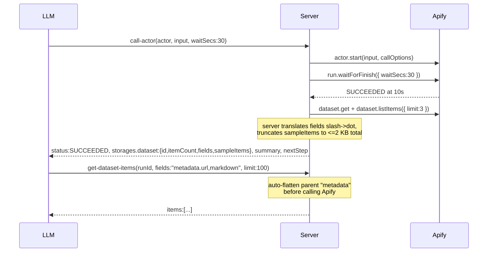
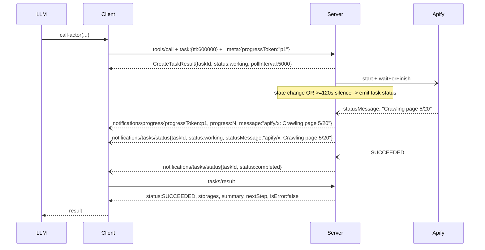

# V4 — `call-actor` redesign (RFC)

Status: locked contract, ready for product + tech review and implementation.
Audience: PM and tech lead. No prior reading required — this document is self-contained.

## Summary

`call-actor` is the entrypoint MCP clients use to run Apify Actors. Today its response is wide and inconsistent: dataset items inline in sync mode, just a `runId` in async, free-form English `instructions` text for the LLM, no progress notifications on long runs, and a cancellation path that leaves the underlying Apify run executing. The unevenness costs LLMs tool calls, produces silent failures (empty dataset reads on nested fields, missed task progress), and bills users for runs they thought they cancelled.

V4 defines a single canonical response shape returned by `call-actor` and `get-actor-run` regardless of mode (sync, task, wait-timeout). The shape mirrors Apify's storage API for familiarity, adds a structured `summary` / `nextStep` pair the LLM can act on directly, and is paired with four substantive companion changes:

1. `get-dataset-items` becomes the canonical retrieval tool — accepts `runId`, auto-flattens dot-notation fields.
2. `abort-actor-run` is promoted into the actor workflow.
3. The Apify run's `OUTPUT` key-value record is inlined when the dataset is empty (so KV-only actors return useful output).
4. Task mode gains real push notifications (`notifications/tasks/status` + heartbeat) and real cancellation (cancel actually aborts the Apify run).

**The public tool name stays `call-actor`.** The cleaner name `run-actor` is a separate, later migration — this PR already changes too much to add a name change on top.

## Why this matters

Concrete failure modes seen in current clients:

1. **Token-budget unpredictability.** Sync `call-actor` embeds full dataset items in the response (truncated to a global character cap). Some actors return 3 rows × 200 B; others return 500 rows × 8 KB. The LLM cannot plan around this.
2. **Sync vs async shape divergence.** Sync returns `{runId, datasetId, items, instructions}`. Async returns just `{runId, ...}`. Two different shapes for the same operation.
3. **Free-form `instructions` text.** Today's `instructions` is opaque English prose, varying per actor and per retry path. There is no machine-checkable contract; LLMs sometimes ignore it.
4. **Silent-failure on dot-notation fields.** `get-dataset-items` requires an Apify `flatten` parameter to access nested fields like `crawl.httpStatusCode`. LLMs that pass `fields: "crawl.httpStatusCode"` without `flatten` get empty rows back with no error. The parallel tool `get-actor-output` papers over this with local projection but is a footgun-shaped wrapper.
5. **No task progress.** Server already emits `notifications/progress` for clients passing `progressToken`, but never emits `notifications/tasks/status` — clients have no push channel for long-running tasks and must poll.
6. **Orphaned Apify runs after cancellation.** `tasks/cancel` marks the task cancelled but does not abort the run. Users continue to be billed for the actor.
7. **No path for KV-only actors.** Many actors write only to the key-value store's `OUTPUT` record. The current response has no place for it; LLMs guess (or fail).
8. **Status enum gaps.** Current code handles `SUCCEEDED`, `FAILED`, `ABORTED`, `TIMED-OUT`. Apify also returns `READY`, `RUNNING`, `TIMING-OUT`, `ABORTING`. Templates and readers ignore four of eight states.

## Goals

- **One canonical shape** returned by `call-actor` and `get-actor-run` — same fields across sync, task mode, terminal, and non-terminal cases.
- **Two-call workflow for the common case.** Call → small structured response → optional `get-dataset-items`. No third "what does this mean" call.
- **No silent failures on field selection.** Server emits dot-notation paths; retrieval auto-flattens.
- **Push notifications** for task progress.
- **Real cancellation.**
- **KV-only actor support** — `OUTPUT` inlined when dataset is empty.
- **All 8 Apify run states** covered by templates and clients.

## Non-goals (deliberate)

- **Rename `call-actor` → `run-actor`** in this PR. Deferred to a separate migration.
- **Convert direct actor tools** (e.g. `apify--rag-web-browser`) to the canonical shape. Separate PR.
- **Inline full dataset retrieval.** A short fixed-size sample + a follow-up call is the contract; no carve-out for "tiny" results. The trade is one round-trip for predictable token cost.
- **Generated JSON Schema in the response.** Today's `schema` field (inferred from items) is dropped. The dot-notation `fields` array tells the LLM what's there.
- **Redesign the `actor: "name:tool"` MCP-server pass-through route.** This route still returns the remote MCP tool's verbatim result; v4 explicitly carves it out but doesn't modify it.

## Design principles

1. **Apify shape fidelity.** Field names in `storages.dataset` / `storages.keyValueStore` mirror `apify-client.Dataset` / `KeyValueStore`. Timestamps become ISO 8601 strings (the only type-level departure). This means anyone who's read Apify docs already knows the field semantics.
2. **The LLM is a first-class consumer.** `summary` (past) and `nextStep` (one primary action) are part of the contract. Templates per status are locked, not free-form.
3. **Hide footguns from the LLM.** Server translates Apify slash-notation to dot-notation. `get-dataset-items` auto-flattens parents when fields contain dots. The LLM never sees the Apify-API edge cases that bit it before.
4. **Run status is observation, not tool failure.** `isError: true` is reserved for tool-side failures (auth, network, Zod validation). `FAILED` / `ABORTED` / `TIMED-OUT` are observed run outcomes, returned with `isError: false`.
5. **Push, don't poll.** Task mode emits `notifications/tasks/status` on every state change and heartbeats every ≥120 s of silence so clients can verify liveness.
6. **Cancellation is propagation, not bookkeeping.** `tasks/cancel` aborts the in-flight Apify run, not just the task store entry.
7. **Truncation is observable.** When a sample is clipped, `sampleNote` says so. When `OUTPUT` is too large to inline, `truncated: true` says so. No silent omissions.

## Locked decisions

| ID | Decision |
|---|---|
| **T1** | `storages` is a subset of the Apify storage API: same field names as `apify-client.Dataset` and `KeyValueStore`, but timestamps are ISO 8601 strings, and fields that are required upstream are optional here when not yet known. We omit security/identity fields (`userId`, `username`, `urlSigningSecretKey`, `generalAccess`, `*PublicUrl`, `actId`, `actRunId`) plus redundant `accessedAt`. We add three fields: `storages.dataset.sampleItems`, `storages.dataset.sampleNote` (only on truncation), and `storages.keyValueStore.output` (only when dataset is empty). |
| **T2** | `summary` describes the past. `nextStep` prescribes one primary action. Both camelCase to match the rest of the response. |
| **R1** | Push notifications are required server work. Emit `notifications/tasks/status` on every task state change AND a heartbeat every ≥120 s of silence while a task is still working. `notifications/progress` already emits today on actor state change; only `tasks/status` is missing. |
| **R4** | Keep `call-actor`; defer the `run-actor` rename. The current name is referenced across the public repo, internal repo tests, UI constants, examples, docs, and the MCP Apps widget wiring; combining identity rename with this contract change would make regressions hard to isolate. Plan rename as a separate migration once this contract is stable. |
| **Q1** | `sampleItems` carries up to 3 deeply truncated items and never exceeds 2 KB serialized total. |
| **Q2** | `get-actor-run` mirrors `call-actor`'s canonical shape, including `storages.dataset.{fields,sampleItems}` when available. |
| **Q3** | `get-dataset-items` and `abort-actor-run` become available in actor-running workflows through loader auto-injection. Default categories stay unchanged. `get-actor-output` remains available for one minor cycle, deprecated, ordered after `get-dataset-items`. |
| **Q4** | Slash-to-dot translation is handled by the server for `storages.dataset.fields`. `get-dataset-items` auto-flattens any parent referenced in dot-notation `fields`. Explicit `flatten` arg remains as a diagnostic override. The LLM never sees slashes and never has to compute a flatten set. |
| **Q5** | `isError` is `false` whenever we observe any terminal actor status (`SUCCEEDED`, `FAILED`, `ABORTED`, `TIMED-OUT`). Task mode lands in `status: completed` for observed actor terminal states. Task `status: failed` is reserved for tool-side failures (auth, validation, network, server). |
| **Q6** | `get-dataset-items` accepts `runId` as an alternative to `datasetId`. |
| **Q7** | `keyValueStore.output` surfaces the conventional `OUTPUT` record inline when present and the dataset has no items. |
| **Q8** | Status enum is the full Apify set: `READY | RUNNING | TIMING-OUT | TIMED-OUT | ABORTING | ABORTED | SUCCEEDED | FAILED`. `ABORTING` and `TIMING-OUT` pass through with their own `summary` and `nextStep` templates. |

## What an LLM sees on a successful call

```json
{
  "responseVersion": "v4",
  "runId": "ABCD1234",
  "actorId": "abc...",
  "actorName": "apify/rag-web-browser",
  "status": "SUCCEEDED",
  "startedAt": "2026-04-29T14:00:00.000Z",
  "finishedAt": "2026-04-29T14:00:22.000Z",
  "stats": { "runTimeSecs": 22, "computeUnits": 0.04, "memMaxBytes": 268435456 },
  "storages": {
    "dataset": {
      "id": "dataset-xyz",
      "itemCount": 47,
      "fields": ["crawl.httpStatusCode", "metadata.url", "markdown"],
      "stats": { "writeCount": 47, "storageBytes": 152340 },
      "sampleItems": [
        {
          "crawl": { "httpStatusCode": 200 },
          "metadata": { "url": "https://example.com" },
          "markdown": "# Welcome[truncated, 4831 chars]"
        }
      ]
    },
    "keyValueStore": { "id": "kv-xyz" }
  },
  "summary": "SUCCEEDED in 22s. 47 items, 3 sample fields.",
  "nextStep": "Use get-dataset-items with runId=ABCD1234 and limit=100 to fetch items."
}
```

The LLM either acts on `nextStep` (one tool call away from done) or summarises `sampleItems` for the user.

## Canonical response shape

Returned by `call-actor` and `get-actor-run` once Apify has created a run. Pre-run failures (validation, auth, network) use the standard MCP error response path and do not conform to this shape.

```ts
{
  responseVersion: "v4",
  runId: string,
  actorId: string,                 // stable Apify actor ID from the run record; always present
  actorName?: string,              // canonical "username/actor-name" when resolvable; falls back to caller-provided name on call-actor; may be omitted on get-actor-run if actor record fetch fails
  status: "READY" | "RUNNING" | "TIMING-OUT" | "TIMED-OUT"
        | "ABORTING" | "ABORTED" | "SUCCEEDED" | "FAILED",
  statusMessage?: string,          // pass-through from Apify run.statusMessage
  exitCode?: number,               // actor process exit code; populated for terminal states (especially FAILED)
  startedAt?: string,
  finishedAt?: string,
  stats?: {
    runTimeSecs?: number,
    computeUnits?: number,
    memMaxBytes?: number,
  },

  storages: {
    dataset: {
      id: string,
      name?: string,
      title?: string,
      createdAt?: string,
      modifiedAt?: string,
      itemCount?: number,
      cleanItemCount?: number,
      fields?: string[],           // dot notation, e.g. ["crawl.httpStatusCode", "searchResult.title"]
      stats?: {
        readCount?: number,
        writeCount?: number,
        deleteCount?: number,
        storageBytes?: number,
      },
      sampleItems?: Record<string, unknown>[],
      sampleNote?: string,         // present only when sampleItems were truncated
    },
    keyValueStore: {
      id: string,
      name?: string,
      title?: string,
      createdAt?: string,
      modifiedAt?: string,
      stats?: {
        readCount?: number,
        writeCount?: number,
        deleteCount?: number,
        listCount?: number,
        storageBytes?: number,
      },
      output?: {                   // inlined OUTPUT record when present and dataset is empty
        contentType?: string,
        value?: unknown,
        sizeBytes?: number,
        truncated: boolean,
      },
    },
  },

  summary: string,
  nextStep: string,
}
```

`_meta` continues to carry usage data (`usageTotalUsd`, `usageUsd`) per existing convention. It is not part of the canonical structured shape and is unaffected by this redesign.

Field-population notes:

- `itemCount` may briefly lag (Apify's pagination counter is eventually consistent, ~5 s post-terminal). When `itemCount: 0` immediately post-terminal but a sample listItems call returns ≥1 item, server re-fetches and uses the larger value.
- `actorId` is the stable identifier; prefer it for any code path that pins a specific actor. `actorName` is for display only.
- `actorName` falls back to the caller's `actor` argument on `call-actor` when the actor record fetch fails. On `get-actor-run` there is no caller-provided name, so `actorName` may be omitted entirely.
- `statusMessage` mirrors `run.statusMessage` verbatim; surfacing it at the top level lets clients render it without re-fetching.
- `exitCode` is most useful for `FAILED`. `SUCCEEDED` runs typically have `0`; aborts may not populate it.
- `fields` is in dot notation. Server reads Apify's slash form and rewrites `/` to `.` before returning.

## Status templates

Every status returns a concrete `summary` and one primary `nextStep`. Templates use `${...}` placeholders the server fills in.

| Status | summary | nextStep |
|---|---|---|
| READY | `"READY. Run ${runId} was created but has not started."` | `"Use get-actor-run with runId=${runId} and waitSecs=10 to wait for progress."` |
| RUNNING | `"RUNNING for ${elapsedSecs}s. ${statusMessage \|\| 'In progress'}."` | `"Use get-actor-run with runId=${runId} and waitSecs=10 to poll for completion."` |
| TIMING-OUT | `"TIMING-OUT after ${elapsedSecs}s. ${statusMessage \|\| 'Run-time limit reached; cleanup in progress'}."` | `"Use get-actor-run with runId=${runId} and waitSecs=10 to observe terminal state."` |
| ABORTING | `"ABORTING after ${elapsedSecs}s. ${statusMessage \|\| 'Cancellation in progress'}."` | `"Use get-actor-run with runId=${runId} and waitSecs=10 to observe terminal state."` |
| SUCCEEDED, dataset has items | `"SUCCEEDED in ${runTimeSecs}s. ${itemCount} items, ${fieldCount} sample fields."` | `"Use get-dataset-items with runId=${runId} and limit=100 to fetch items."` |
| SUCCEEDED, dataset empty + KV OUTPUT present | `"SUCCEEDED in ${runTimeSecs}s. Output was written to key-value store."` | `"Read storages.keyValueStore.output here (full record inlined unless truncated:true). For a truncated record, the storage tool category provides get-key-value-store-record."` |
| SUCCEEDED, no dataset items, no OUTPUT | `"SUCCEEDED in ${runTimeSecs}s. No dataset items and no OUTPUT record were found."` | `"Inspect statusMessage and stats in this response; if the missing output was unexpected, re-run call-actor with adjusted input."` |
| FAILED | `"FAILED after ${runTimeSecs}s${statusMessage ? ': ' + statusMessage : ''}."` | `"Diagnose using statusMessage and exitCode in this response; re-run call-actor with adjusted input if the cause is fixable."` |
| ABORTED | `"ABORTED after ${runTimeSecs}s${statusMessage ? ': ' + statusMessage : ''}."` | `"Use call-actor again if you want to rerun the actor."` |
| TIMED-OUT | `"TIMED-OUT after ${runTimeSecs}s."` | `"Use get-dataset-items with runId=${runId} and limit=100 to fetch any partial output."` |

`elapsedSecs` is `(now - startedAt)` for non-terminal states. `runTimeSecs` comes from `stats.runTimeSecs` for terminal states. `fieldCount` is the count of distinct top-level keys visible in `sampleItems`.

A text-mode response (for clients that don't read structured content) carries `JSON.stringify(storages.dataset.sampleItems)` followed by a summary block of `${summary}`, `${nextStep}`, and the run identifiers. The summary block is preserved verbatim; samples are truncated first if the response would exceed the global character cap.

## Behavior contracts

### Synchronous (default mode)

`call-actor` accepts `waitSecs` (0–120, default 30). Behavior:

- `waitSecs: 0` returns after `actor.start(...)` with status `READY` or `RUNNING`.
- `waitSecs ∈ [1, 120]` waits up to that many seconds for terminal status, then returns whatever it observed.
- Long-running actors return non-terminal status with a polling `nextStep`. The server does not block indefinitely on the LLM's behalf.
- Note: Apify's start endpoint caps API-side waiting at 60 s. Server uses `start` followed by `waitForFinish({ waitSecs })`, never `waitForFinish` inside `start` options.

### Task mode

Task mode is selected when the client passes `task: {...}` on `tools/call`. The server returns `CreateTaskResult` immediately and runs the underlying tool in the background until terminal or cancelled.

- `waitSecs` and `async` from the args are **overridden** at the task boundary. The task always waits until terminal — honoring `async: true` would let the task complete the moment the actor started, which is wrong. If the caller sends both `task: {...}` and `async: true`, log a deprecation event but still wait until terminal.
- Push notifications: `notifications/tasks/status` emits on every state change and heartbeats every ≥120 s of silence.
- `tasks/result` returns the canonical shape (same as sync mode).
- See **Cancellation** below.

### MCP-server Actor pass-through

`call-actor` accepts `actor: "username/name:mcpToolName"` for invoking specific tools on Apify Actors that are themselves MCP servers (e.g. `apify/actors-mcp-server:fetch-apify-docs`). When `mcpToolName` is non-empty, the call delegates to the remote MCP server and returns its tool result verbatim.

This route is **excluded from the canonical shape**. It does not produce a run, has no `runId` / `storages` / `summary` / `nextStep`. `_meta` usage attribution on this path follows existing behavior — v4 does not change it. Task wrapping is allowed (the task tracks the remote MCP request as its work); cancellation aborts the in-flight remote MCP request, not an Apify run.

The tool description must explain both routes side by side so the LLM does not assume the canonical shape is always returned.

## isError and task lifecycle

- **`isError: false`** whenever any terminal actor status is observed (`SUCCEEDED`, `FAILED`, `ABORTED`, `TIMED-OUT`). The tool succeeded in observing the run; the actor outcome lives in `status`.
- **`isError: true`** is reserved for tool-side failures: invalid input (Zod), Apify auth failure, network unreachable, server crash. These all return before any actor terminal status is observed.

In task mode:

- Task → `status: completed` whenever an actor terminal status is observed (regardless of which terminal). The actor outcome flows through `status` in the result.
- Task → `status: failed` only for tool-side failures. Because the MCP task result shape has no dedicated reason field, the failure reason is stored in `task.statusMessage` so clients can read it via `tasks/get`.
- Task → `status: cancelled` when `tasks/cancel` is invoked. The cancel handler aborts the in-flight Apify run.

## Cancellation

Required behavior: `tasks/cancel` aborts the underlying Apify run, not just the task entry.

Architectural shape: the server holds a per-task in-flight reference (an `AbortController` plus, once known, the `runId`). When `tasks/cancel` fires, the server aborts the controller and, as a safety net for any race where the run was created but the controller didn't reach it in time, also aborts the run by `runId`. The reference is cleared on terminal transition.

Two race conditions are explicitly accounted for:

1. **Cancel before run starts.** Aborting the controller while `actor.start(...)` is still in flight does not prevent the run from being created in the brief race window. The implementation aborts the run as soon as `start` returns. The test contract is "no un-aborted orphan run remains" — not "no run is ever created."
2. **Cancel after start, before terminal.** Standard case. The controller signal reaches the in-flight wait-for-finish loop, which calls `run.abort()`.

## Truncation policies

### `sampleItems` (dataset preview)

Up to 3 items, 2 KB serialized total. Per item, walk the JSON tree:

- Strings: first 80 UTF-16 code units plus `[truncated, N chars]` when truncated.
- Arrays: keep the first element only and recurse into it. Arrays stay homogeneous — no string sentinel embedded in arrays, because mixing types misleads downstream schema inference.
- Objects: recurse into properties in original order.
- Numbers, booleans, null: preserve as-is.

After per-item truncation, if the total still exceeds 2 KB, drop items from the end until either the payload fits or only one item remains. If a single item still exceeds 2 KB, run a second pass that replaces deep or long values with short sentinels and drops properties from the end.

When any truncation happens, set `storages.dataset.sampleNote` to a short string describing what was clipped, e.g. `"sample preserves first array element only; long strings truncated to 80 chars"`. Omit when no truncation occurred.

Goal: preserve representative field names and enough small values for orientation. Not every leaf field name will be visible for wide objects — and that's acknowledged, not promised away.

### `keyValueStore.output` (KV-only actors)

When the effective dataset item count is 0 and the run has a default key-value store, the server inspects the `OUTPUT` key. Behavior:

- If `OUTPUT` is absent, `output` is omitted.
- If `OUTPUT` size > 2 KB, return a descriptor `{ sizeBytes, value: "[OUTPUT record present, N bytes]", truncated: true }`. Do not fetch the body.
- If `OUTPUT` size ≤ 2 KB, fetch and inline the value. JSON-compatible values pass through; non-JSON small records may be inlined as text only when safe, otherwise summarized as a descriptor with `truncated: true`.

The "effective" item count uses the post-terminal re-fetch result, not just the first counter read.

## Tool surface

| Tool | Status | Behavioral notes |
|---|---|---|
| `call-actor` | Canonical | Accepts `actor`, `input`, `waitSecs?` (0–120, default 30), `callOptions?`. `taskSupport: "optional"`. |
| `run-actor` | Deferred | Not implemented in this PR. Plan as a separate rename migration. |
| `get-actor-run` | Modified | Adds `waitSecs` (0–120, default 0 to preserve current immediate-poll behavior). Returns the canonical shape. |
| `get-dataset-items` | Promoted in actor workflows | Accepts `runId` OR `datasetId`. Defaults `limit` to 100. Auto-flattens dot-notation `fields`. Explicit `flatten` remains as a diagnostic override. |
| `abort-actor-run` | Promoted in actor workflows | Auto-surfaced when actor-running tools are present. |
| `get-actor-output` | Deprecated | Kept for one minor cycle. Description prefixed `DEPRECATED:`; points to `get-dataset-items`. |

Auto-injection policy: when `call-actor`, a direct actor tool, or `add-actor` is present in the active tool set, the loader also surfaces `get-actor-run`, `get-dataset-items`, and `abort-actor-run`. `get-actor-output` is kept injected for one minor cycle, ordered after `get-dataset-items`.

### `get-dataset-items` — substantive change

The behavioral change that actually closes the silent-failure gap:

- Accepts `runId` OR `datasetId` (exactly one required). When `runId` is provided, server resolves the default dataset from the run record.
- When `fields` contains dot-notation paths (e.g. `"metadata.url"`), the server derives the unique top-level parent prefixes and passes them as `flatten` to Apify automatically. The LLM never has to know about Apify's `flatten` parameter.
- If the caller provides explicit `flatten`, it overrides the auto-derivation (diagnostic escape hatch).
- Default `limit: 100` when omitted, to prevent inadvertent large reads.

This is the change that lets us deprecate `get-actor-output`: once `get-dataset-items` handles dot-notation by default, the local-projection workaround is no longer needed.

## `callOptions` allowlist

`call-actor` validates `callOptions` strictly. Allowed:

| Key | Type | Why |
|---|---|---|
| `timeout` | number, seconds | Actor run-time cap |
| `memory` | number, MB | Actor memory allocation |
| `build` | string | Specific actor build |
| `maxItems` | number | Charge cap for pay-per-result actors |
| `maxTotalChargeUsd` | number | Charge cap for pay-per-event actors |

Rejected (with reason):

- `waitForFinish` — use top-level `waitSecs`.
- `webhooks` — redirects run events to caller-controlled URLs (security).
- `contentType` — this tool sends JSON object input only.
- `forcePermissionLevel` — permission escalation should not be exposed here.
- `restartOnError` — can multiply cost without an explicit client workflow.
- `proxy` and any other unknown key.

The new behavior is strict rejection, not silent stripping.

## Input compatibility

Canonical input:

```ts
{
  actor: string,                        // "username/name" or "username/name:mcpToolName"
  input: Record<string, unknown>,       // required object; pass {} for actors with no input
  waitSecs?: number,                    // 0-120, default 30 for call-actor
  callOptions?: { timeout?, memory?, build?, maxItems?, maxTotalChargeUsd? },
}
```

`input` stays required, matching today's behavior.

Deprecated fields accepted for one minor cycle so old hardcoded callers do not fail immediately:

- `async: true` maps to `waitSecs: 0`.
- `async: false` maps to the default `waitSecs`.
- Both `async` and `waitSecs` together: rejected as ambiguous.
- `previewOutput` accepted but ignored. `sampleItems` is always capped to 2 KB, so the original token-risk reason for disabling previews no longer applies.

Deprecated fields are not promoted in the tool description.

## End-to-end flows

### Tier A — synchronous, fast actor



### Tier B — task mode, long-running actor



## Migration impact

| Change | Impact |
|---|---|
| Response: `datasetId` → `storages.dataset.id` | Hard. Widgets and clients reading top-level `datasetId` must update. |
| Response: `items` removed from `call-actor` / `get-actor-run` | Hard. Replaced by `sampleItems` plus `get-dataset-items`. |
| `previewItems` → `storages.dataset.sampleItems` | Hard. Different field, smaller capped content. |
| `instructions` → `summary` + `nextStep` | Hard. Different semantics and names. |
| `schema` field dropped; `fields` returned in dot notation | Hard. JSON Schema generation is removed from this path. |
| `call-actor` default wait changes to 30 s | Hard for long-running actors. They now return non-terminal with a polling `nextStep` instead of blocking indefinitely. |
| `async` parameter deprecated but accepted | Soft. `async: true` maps to `waitSecs: 0`; remove next minor cycle. |
| `previewOutput` deprecated but accepted | Soft. Ignored because `sampleItems` is capped. Remove next minor cycle. |
| `get-actor-output` deprecated | Soft for one cycle. Still callable; description points to `get-dataset-items`. |
| `get-dataset-items` auto-flattens dot-notation `fields` | Soft. Explicit `flatten` still works as override. |
| `get-dataset-items` accepts `runId` | Soft. Additive. |
| `abort-actor-run` auto-surfaced in actor workflows | Soft. Additive. |
| `get-actor-run` adds `waitSecs`, default 0 | Soft. Existing callers keep immediate-poll behavior. |
| `isError` unified | Soft for tool-call semantics, but clients using task `status: failed` to detect actor failure must read inner `status` instead. |
| `keyValueStore.output` surfaced inline when dataset empty | Soft. Additive. |
| `responseVersion: "v4"` added | Soft. Additive. |
| `callOptions` strict allowlist | Potentially hard. Verify current unknown-key behavior first; reject unsafe keys explicitly. |
| Status enum widened to all 8 Apify states | Soft. Additive. |
| `actorId` added; `actorName` becomes optional | Soft (additive). `actorName` was never present on the shipped `call-actor` shape and was already optional on `get-actor-run`. |
| `statusMessage` and `exitCode` added at top level | Soft. Additive. |
| `storages.dataset.sampleNote` added | Soft. Additive, only on truncation. |
| `tasks/cancel` now propagates to `run.abort()` | Soft (bug fix). The current behavior — orphaned runs continuing after cancel — is an oversight, not load-bearing semantics. |
| Task mode forces `waitSecs` to wait-until-terminal and ignores `async: true` | Soft. Additive defensive behavior. |
| `actor: "name:tool"` MCP-server pass-through is excluded from the canonical shape | No new behavior; the doc just admits the carve-out exists. |

Breaking changes must be coordinated with `apify-mcp-server-internal` before merge. The internal repo is spared the tool-name migration (no rename), but **not** the contract migration:

- Response-shape readers must migrate from `datasetId`, `items`, `previewItems`, and `instructions`.
- Tool-list tests must reflect `get-dataset-items` and `abort-actor-run` auto-surfacing.
- Any internal code assuming `get-actor-output` is the default retrieval tool must move to `get-dataset-items`.

## Widget impact

Three apps-mode tools share this canonical shape and must be updated together: the apps-mode `call-actor`, `call-actor-widget`, and `get-actor-run-widget`. The actor-run widget must:

- Read `storages.dataset.id` instead of top-level `datasetId`.
- Read `storages.dataset.sampleItems` instead of `previewItems`, or fetch `get-dataset-items` with `runId` and `limit` when it needs a larger table.
- Read `storages.dataset.sampleNote` (when present) and surface a "preview truncated" indicator.
- Read top-level `statusMessage` and `exitCode` directly instead of re-fetching.
- Poll `get-actor-run` with `waitSecs: 0` so widget refreshes do not block.
- Accept the old shape for one minor cycle only if cheap to do so. Do not add complex compatibility branches.

## Risks and open questions

- **Heartbeat interval (120 s).** Picked from intuition; tune after observing real clients. Too aggressive and we burn notifications; too lazy and clients suspect the server is dead.
- **Cancellation race window.** Cancel-before-start does create a brief Apify run that is then aborted. We accept this and assert "no un-aborted orphan." If accounting becomes a problem, the alternative is to delay run creation until after a debounce, which adds latency to the common case.
- **No tiny-result inline carve-out.** Agents always make one extra call for actor output, even for trivially small datasets. Predictable token cost vs. one extra round-trip is the trade.
- **Free-form `statusMessage`.** Actor authors set it. Some are useful ("Crawling page 5/20"), some are noise. Templates pass it through verbatim; we accept variability rather than try to normalize.
- **`get-key-value-store-record` not auto-surfaced.** Truncated `OUTPUT` records require the storage tool category to fetch the full body. The `nextStep` mentions this; LLMs without the storage category will surface the limitation rather than fetch.
- **`responseVersion` versioning policy.** We bump to `v4`. Future breaking shape changes bump again; additive changes do not. Clients can feature-detect.

## Out of scope (deliberate deferrals)

- Rename `call-actor` to `run-actor` — separate migration after this contract stabilizes.
- Convert direct actor tools (e.g. `apify--rag-web-browser`) to the canonical shape — separate PR.
- Remove deprecated `async`, `previewOutput`, and `get-actor-output` — next minor cycle.
- `taskSupport` on `get-actor-run` — revisit after task adoption is measured.
- Heartbeat interval tuning — based on real telemetry.
- Convert MCP-server pass-through (`actor:tool`) to a uniform shape — orthogonal redesign.

## What we will test

End-to-end behavioral assertions, summarised:

- **Canonical shape** is returned for sync `call-actor` and `get-actor-run` against a representative actor (rag-web-browser).
- **`get-dataset-items` with dot-notation `fields`** returns nested values without explicit `flatten` (auto-flatten works).
- **KV-only actor** inlines `storages.keyValueStore.output`; large `OUTPUT` returns a descriptor with `truncated: true`, body unfetched.
- **Task mode** lands in `completed` for an actor that finishes in any terminal state, including `FAILED`.
- **Synthetic infra failure** (invalid actor, sandboxed revoked token) lands in task `failed` and populates `task.statusMessage`.
- **Push notifications**: at least one `notifications/tasks/status` arrives between `tasks/created` and `completed`. A heartbeat fires after ≥120 s of `statusMessage` silence (test-mode override to keep the suite fast).
- **Cancellation**: `tasks/cancel` mid-run results in the underlying Apify run reaching `ABORTED`; task transitions to `cancelled`; a `tasks/status: cancelled` notification fires. Cancel-before-start results in an `ABORTED` run (no un-aborted orphan).
- **Task mode override**: `task: {...}` plus deprecated `async: true` does not short-circuit the task; it waits until terminal.
- **MCP-server pass-through**: `actor: "name:tool"` returns the remote MCP tool result, not the canonical shape; `responseVersion` is absent on this path.
- **`callOptions` allowlist**: rejects `waitForFinish`, `webhooks`, `contentType`, `forcePermissionLevel`, `restartOnError`, `proxy`, and unknown keys.
- **Truncation contract**: `sampleItems` never exceeds 2 KB serialized total; arrays remain homogeneous; `sampleNote` is set iff truncation occurred.
- **Apps widget**: reads the new shape and polls with `waitSecs: 0`.

Per-change validation against the local stdio build is required (per repo convention). Integration tests against the live Apify API require a real token and are run by humans / CI, not by agents.
