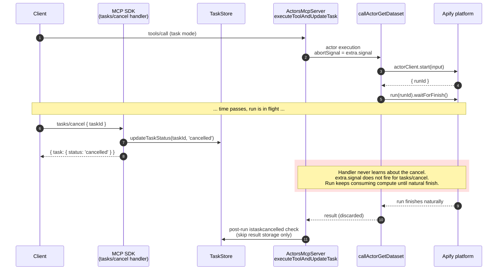
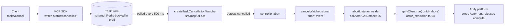

# `tasks/cancel` → Actor abort flow

How a client's `tasks/cancel` request gets translated into an actual
`apifyClient.run(runId).abort()` call against the Apify platform, and what
PR #812 (issue #763) changed.

Verify line numbers against current source before trusting them.

## The bug

The MCP SDK's `tasks/cancel` request handler
(`@modelcontextprotocol/sdk/dist/esm/shared/protocol.js`,
`CancelTaskRequestSchema` handler) does this and only this:

1. Reads the task from the `TaskStore`.
2. Verifies it is not in a terminal status.
3. Writes `status='cancelled'` to the `TaskStore`.
4. Clears the task's pending message queue.
5. Returns the cancelled task.

It does **not** abort the in-flight request's `AbortController`.

This differs from the older `notifications/cancelled` notification
(handled by the SDK's `_oncancel`), which **does** call
`controller.abort()` on the request handler's controller.

Net effect before PR #812: a client could call `tasks/cancel`, the task
would flip to `cancelled`, but the tool handler would keep running. The
underlying Apify Actor run would keep consuming compute until natural
completion. The bug shows up as "I cancelled, but my Apify bill kept
ticking."

## Where the actor is actually aborted

A single line in `src/tools/core/actor_execution.ts:64`:

```ts
await apifyClient.run(runId).abort({ gracefully: false });
```

Wrapped in `abortActorRun(runId)` (`src/tools/core/actor_execution.ts:62-68`).
This call existed before PR #812 — it is wired to fire when an `AbortSignal`
passed in via the `abortSignal` parameter aborts. PR #812 did not touch
`actor_execution.ts`; it just made sure the right `AbortSignal` reaches it.

## Before PR #812



the post-run `istaskcancelled` check at `src/mcp/server.ts:1485` mitigated
the *result-storage* half of the problem (we don't return data for a
cancelled task) but did nothing about the *compute-consumption* half.

## after pr #812

```mermaid
sequencediagram
    autonumber
    participant client
    participant sdk as mcp sdk<br/>(tasks/cancel handler)
    participant store as taskstore
    participant watcher as createtaskcancellationwatcher<br/>(polls every 500 ms)
    participant server as actorsmcpserver<br/>executetoolandupdatetask
    participant exec as callactorgetdataset
    participant apify as apify platform

    client->>server: tools/call (task mode)
    server->>watcher: create watcher<br/>(taskid, mcpsessionid, taskstore)
    server->>exec: actor execution<br/>abortsignal = cancelwatcher.signal
    exec->>apify: actorclient.start(input)
    apify-->>exec: { runid }
    exec->>apify: run(runid).waitforfinish()

    loop every 500 ms
        watcher->>store: gettask(taskid)
        store-->>watcher: status: 'working'
    end

    client->>sdk: tasks/cancel { taskid }
    sdk->>store: updatetaskstatus(taskid, 'cancelled')
    sdk-->>client: { task: { status: 'cancelled' } }

    watcher->>store: gettask(taskid)
    store-->>watcher: status: 'cancelled'

    rect rgba(0, 180, 0, 0.15)
        watcher->>watcher: controller.abort(...)<br/>cancelwatcher.signal fires
        watcher-->>exec: abortsignal 'abort' event
        exec->>apify: run(runid).abort({ gracefully: false })
        apify-->>exec: aborted
    end

    exec-->>server: returns null (aborted)
    server->>watcher: dispose() in finally
    server->>store: skip result storage<br/>finishtasktracking(aborted)
```

`cancelWatcher.signal` replaces `extra.signal` at the two places where
the in-flight execution observes cancellation:

- `src/mcp/server.ts:1349` — internal-tool branch (`tool.call({ extra: taskExtra })`)
- `src/mcp/server.ts:1382` — direct-actor-tool branch (`abortSignal: cancelWatcher.signal`)

Both branches funnel into `callActorGetDataset` (or other code paths that
respect `AbortSignal`). The abort listener inside `callActorGetDataset`
(`src/tools/core/actor_execution.ts:96-101`) reacts and calls
`abortActorRun(runId)` → `apifyClient.run(runId).abort()` at line 64.

## End-to-end signal path



## Why the request's `extra.signal` is intentionally NOT chained

Per the MCP tasks spec, a task's lifetime is **decoupled** from the
original request. Once the task is created and `{ task }` is returned,
the request is complete and the task continues independently. Client
disconnect, transport close, or `notifications/cancelled` for the
original request ID MUST NOT cancel the task — only `tasks/cancel`
(which writes `cancelled` to the TaskStore) is allowed to.

`createTaskCancellationWatcher` therefore reads only from the TaskStore
and exposes a fresh `AbortController`. It does NOT subscribe to
`extra.signal` from the original request handler. Earlier drafts of this
helper chained the parent signal as a "free" cancel path; that was
spec-incorrect and was removed before merge.

In practice the parent signal cannot fire after the task is created
anyway: the SDK deletes the request's `AbortController` from
`_requestHandlerAbortControllers`
(`@modelcontextprotocol/sdk/dist/esm/shared/protocol.js` lines 419-420)
in the `.finally()` callback that runs after the response is sent, and
`executeToolAndUpdateTask` runs in `setImmediate` after that. But "it
can't fire" is not the same as "it's safe to subscribe to" — a future
SDK change or an aggressive transport could violate that timing, and
the tests would silently lock in the wrong behaviour. Not subscribing
in the first place keeps the contract explicit.

The unit test
`does not abort when an unrelated AbortSignal fires (task survives client disconnect)`
in `tests/unit/mcp.utils.test.ts` is the regression guard.

## Why polling, not a callback

In multi-node deployments (the hosted Apify MCP server runs on multiple
pods sharing one Redis-backed `TaskStore` — `RedisTaskStore` in the
internal repo), `tasks/cancel` may arrive on a **different** node from
the one running the handler. The `AbortController` lives in the executing
node's process memory and cannot be reached from another pod. The shared
`TaskStore` is the only signal the executing pod can observe — so it
must poll.

500 ms is a deliberate compromise between cancel latency and Redis load.
See `src/mcp/utils.ts` `createTaskCancellationWatcher` docstring.

The internal repo's
`test/multinode/slow-multi-node-actor-cancellation.test.ts:169-221`
exercises this cross-node path end-to-end: client 1 starts a task on
node 1, client 2 calls `cancelTask` on node 2, node 1's poll loop reads
the cancelled status from Redis and aborts the local watcher.

## Race-condition guards already in `callActorGetDataset`

The abort can arrive before there is a `runId` to abort. Two pre-existing
guards handle this — they were not added by PR #812 but they make the
chain robust:

- **Before `start()`** (`actor_execution.ts:72-75`): if `abortSignal.aborted`
  is already true, return without starting.
- **After `start()`** (`actor_execution.ts:83-88`): `actorClient.start()`
  is not tied to the `AbortSignal`, so a cancel during the start RPC is
  invisible until `start()` resolves. We immediately re-check and abort
  the freshly-created run ourselves.
- **Steady state** (`actor_execution.ts:110-119`):
  `Promise.race([waitForFinish(), abortPromise])` plus listener cleanup
  on the winner so a stale abort cannot fire on a run that already
  finished naturally.

## Hardening on top of the polling loop

Two extra defenses live inside `createTaskCancellationWatcher`:

- **`tickInFlight` guard.** Skips a tick if the previous one is still
  awaiting `getTask`. Without this, Redis tail-latency spikes (cluster
  reslot, failover) cause ticks to pile up and amplify load right when
  the backend is struggling.
- **`try/catch` with `log.softFail`.** `RedisTaskStore.getTask` is a
  single Redis HGET that can throw on transient cluster errors. Without
  the catch, a single Redis blip becomes an unhandled promise rejection
  → with Node's default `--unhandled-rejections=throw` the worker pod
  crashes, killing every other session it serves. The catch logs and
  keeps polling so the next successful tick still aborts.

## Files of interest

| Path | Role |
|---|---|
| `src/mcp/utils.ts` — `createTaskCancellationWatcher` | The polling watcher. Bridges TaskStore status → AbortSignal. |
| `src/mcp/server.ts:1290-1299` | Constructs the watcher per task in `executeToolAndUpdateTask`. |
| `src/mcp/server.ts:1382` | Threads the chained signal into the direct-actor-tool branch. |
| `src/mcp/server.ts:1349` | Threads the chained signal into internal-tool calls. |
| `src/mcp/server.ts:1512` | `dispose()` in `finally` to stop polling. |
| `src/tools/core/actor_execution.ts:62-68` | `abortActorRun(runId)` wrapper. |
| `src/tools/core/actor_execution.ts:64` | The actual `apifyClient.run(runId).abort()`. |
| `src/tools/core/actor_execution.ts:72-101` | Race-condition guards around `start()` and the abort listener. |
| `tests/integration/suite.ts` | E2E test: cancel mid-run, assert Apify run reaches ABORTED. |
| `tests/unit/mcp.utils.test.ts` | Unit tests for the watcher (happy path, parent abort, dispose, transient errors, no overlap). |
| internal repo `test/multinode/slow-multi-node-actor-cancellation.test.ts:169-221` | Cross-node regression test for the polling path. |
